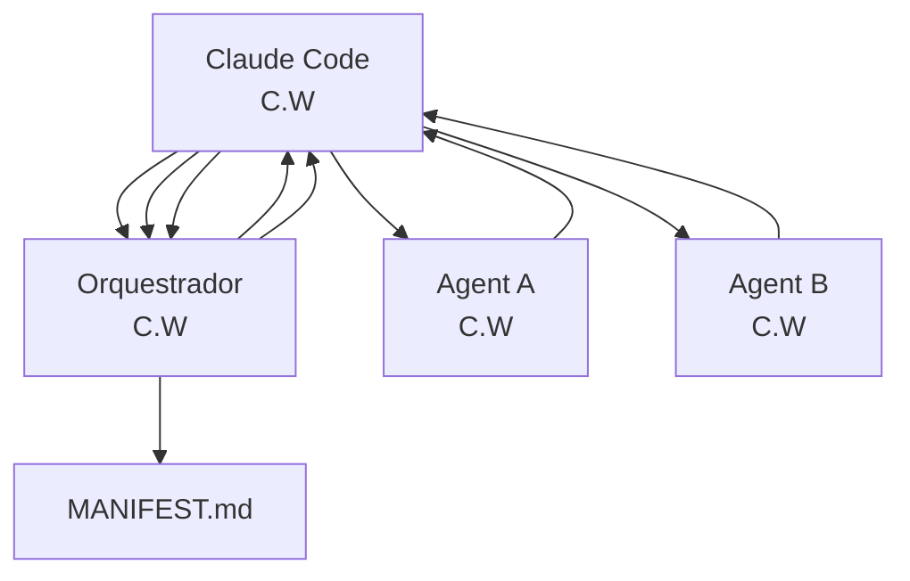
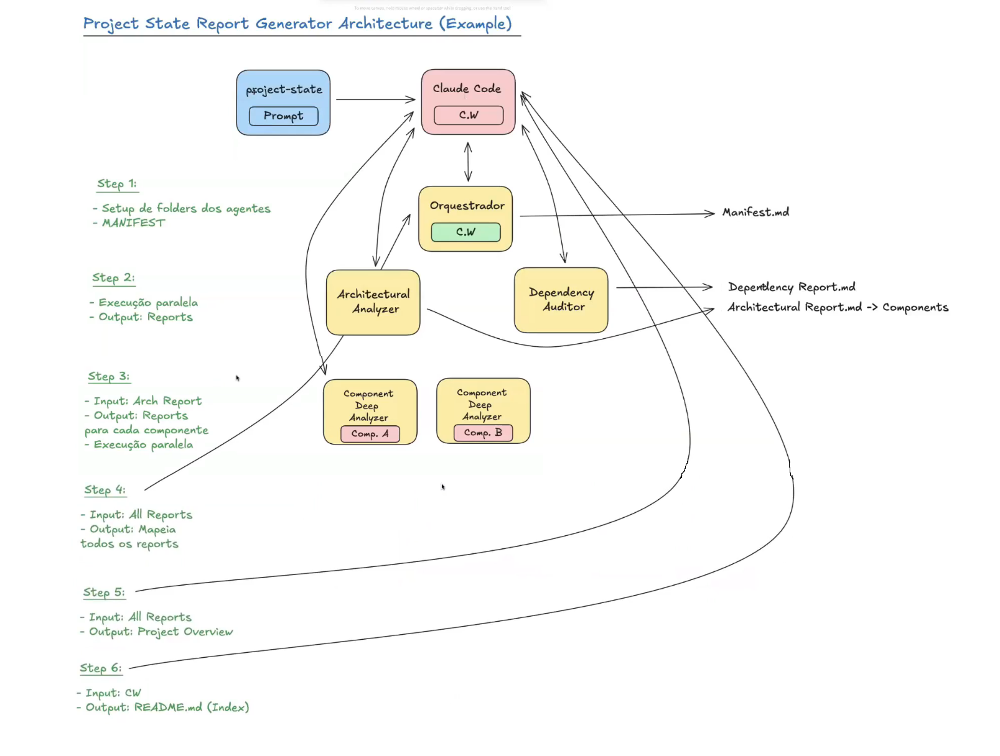

Modernização de Sistemas Legados e Prompt Engineering
- Existem inúmeras maneiras para realizar a modernização de sistemas
- Não existe fórmula. Cada projeto é um projeto.
Apesar disso, muitos processos de modernização seguem passos parecidos:
- Project State
- Estratégia
- Priorização
- Plano de Ação
- Execução
- Avaliação


Project State
- O principal passo para iniciar o processo de modernização de qualquer tipo de sistema, independente de seu tamanho, é conseguir ter um conjunto de análises detalhadas em diversas perspectivas.
Sem ter o state atual do projeto, não é possível:
- Priorizar
- Identificar riscos
- Avaliar arquitetura
- Entender componentes
- Acoplamento entre componentes
- Regras de negócio
- Pontos de integração
- Single Points of Failure
- Dependências de bibliotecas e frameworks, suas versões, vulnerabilidades, etc.
- Segurança


Influência da IA no Project State
Nunca foi tão “acessível” explorar um projeto complexo para levantar as informações necessárias para gerar um Project State.
Apesar dessa acessibilidade, o famoso “saber o que e como pedir para a IA” não é trivial.
Barreiras: 
- Saber o que pedir, porém definir o que você quer de resultado final
- Janelas de contexto limitadas, principalmente em projetos muito grandes
- Mesmo com modelos com mais de 1Mi de tokens, a ambiguidade gerada pela IA aumenta
- Necessidade de um processo iterativo que mantenha estado
- Geração de diversos documentos
Workflow:
- Independente do modelo de IA ou ferramenta, possuir um workflow definido garante consistência no resultado final
- Mesmo que seja manual, é possível seguir passos claros e obter um resultado satisfatório
- Ao utilizar agentes / prompts específicos para cada tarefa, a chance de sucesso aumenta significativamente
- Ferramentas multi‑agênticas podem poupar muito tempo e gerar mais consistência no resultado


Prompts! Prompts! Prompts!
- Prompts step‑by‑step ajudam a proteger o workflow
- Prompts especializados para cada área / relatório garantem muito mais assertividade no resultado
- Não é possível executar prompts de baixo nível antes de ter as informações de alto nível
- Um prompt precisa usar o resultado de outra iteração como contexto

Prompts como Sub‑agentes (Claude Code)
```
[Claude Code] --> context Window
  |
  |--> [Agent A] • 	Claude Code NÃO possui acesso à C.W dos Agents e vice‑versa.
  |--> [Agent B] • 	Eles se comunicam por chamada e output da chamada.

[Command A (Prompt)]
• 	Prompt pode solicitar qualquer coisa ao Claude, inclusive a invocação de agentes.
• 	Agentes podem ser executados em paralelo!
```


# Orquestradores e gerenciamento de estado

- Janela de contexto é limitada  
- Processos podem ser interrompidos por diversos motivos

Como cada agente não possui acesso a **Janela de Contexto** do outro, a utilização de um agente **"orquestrador"** se faz útil, pois ele mantém o **tracking do workflow**.

```
[Claude (C.W.)]
|
|<--> [Orquestrador (C.W.O.)] --> Manifest.md
      |
      |<--> [Agent A (C.W.A.)]
      |<--> [Agent B (C.W.B.)]

```



## Project State Report Generator


Estruturados com resultados específicos (Especialistas)
- Persona e Escopo
- Objetivo
- Entradas
- Formato de saída
- Critérios de qualidade
- Tratamento de ambiguidades e "assumptions"
- Instruções negativas
- Tratamento de erros

Workflow Specification Prompt (Commands)
- Description
- Output template
- Critical Constraints
- Execution Workflow
- Usage Examples
- Negative Instructions
- Instruções negativas

Role Specification (Orquestrador)
- Role Definition
- Core Responsibilities
- Operational Framework
- Decision-Making Principles
- Communication Standards