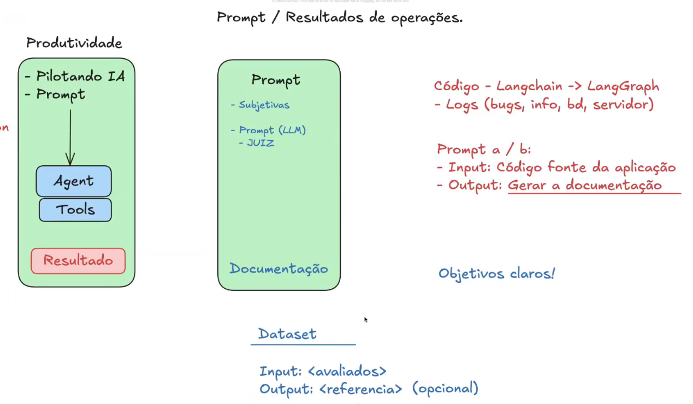

Praticamente uma abertura do modulo de evaluation

06-Prompt engeneering\07-Prompt Evaluation.md

Ele apresenta o Langchain / Langgraph / Langsmith que é visto nas aulas acima de prompt engeneering.

Biblioteca Gagas (Evaluation de RAG) ainda não vi.

