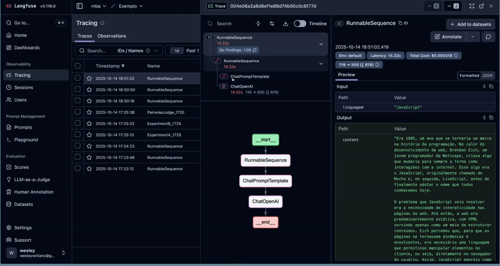
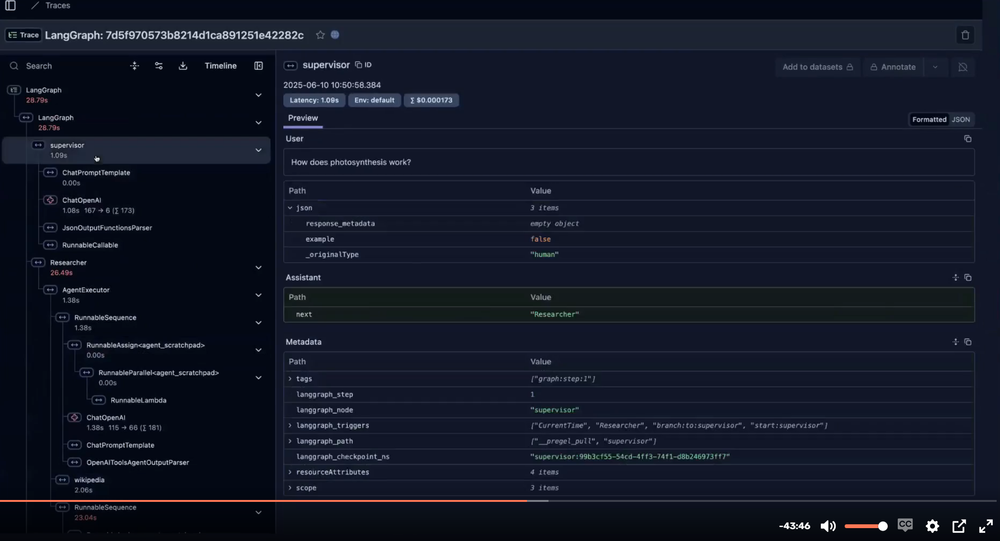
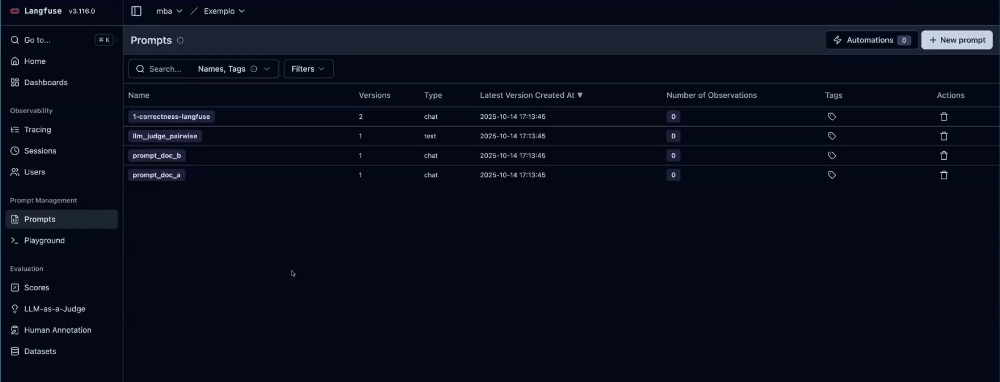
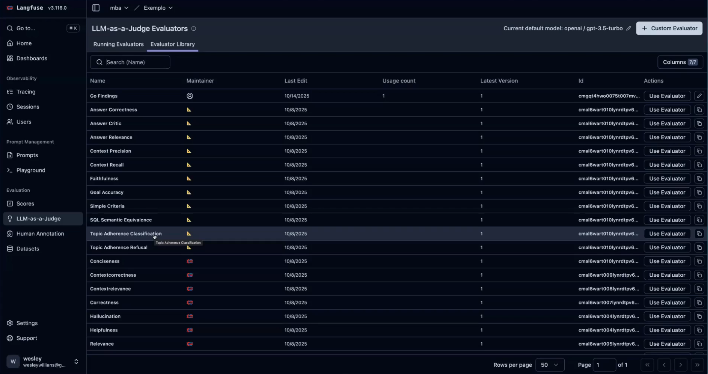
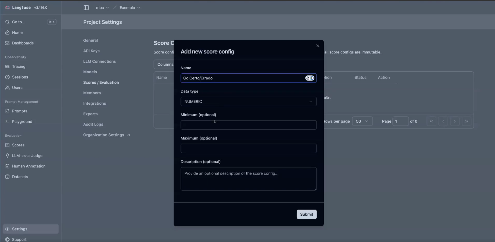
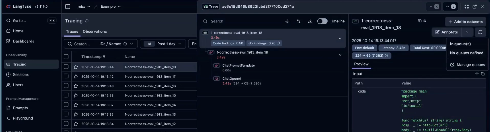
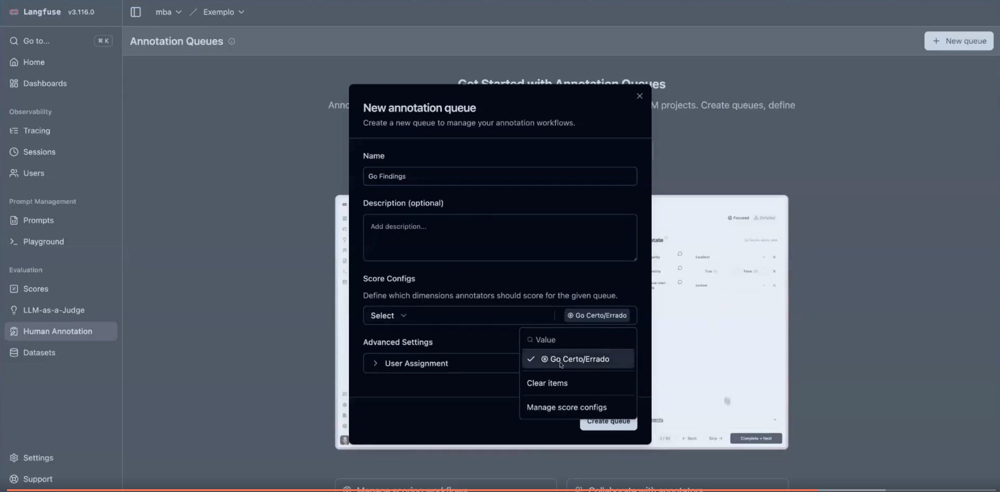
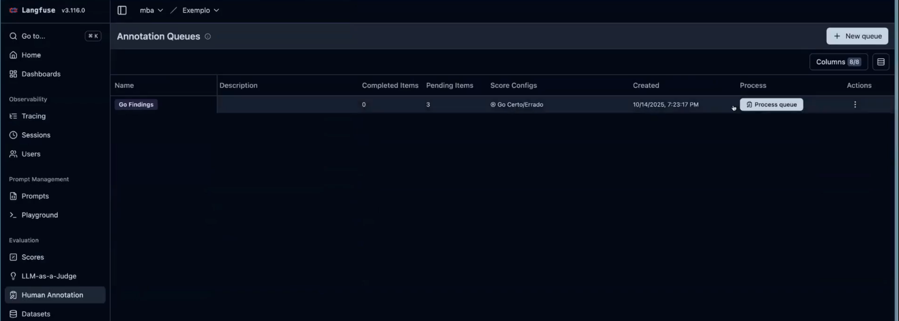
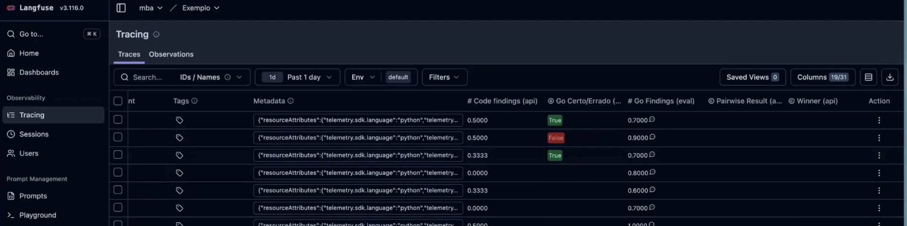

# Langfuse

- Open Source LLM Engineering Platform
- Opensource
- Observabilidade
- Métricas
- Gerenciamento de prompts
- Playground
- Evaluation
- Annotations
- Dashboard customizável
- Multi-tenancy
- SDK para integrações via API

## Observabilidade
- Tracing
- Contato low level com LLM
- Latência
- Custo

## Prompts
- Gerenciamento de versão e deploy
- Colaboração entre usuários
- Playground

## Evaluation
- Avaliação de resultados gerados pelo LLM
- Monitoramento em tempo real
- Métricas "built-in"
- LLM-as-a-judge customizada
- Scores
- Anotações

## LLMs Produtividade vs Integração/Sistemas com LLM

| Produtividade (Coding) | Integração |
| --- | --- |
| Exemplos de métricas, ferramentas e práticas para aumentar produtividade (tests, CI, linters, templates) | Exemplos de integrações, APIs, SDKs e fluxos (Langfuse SDK, webhook, tracing, APM) |
| Copilot/Claude | Langfuse / Prompt Layer / Langsmith |
Testes Automatizados,Teste manual, Debugging, Tracing, Log, APM | Tracing (LLM), LOG (LLM), APM (LLM), Testes de prompt
Não costuma se preocupar com token | Muito caro, precisa ser bem monitorado e avaliado.

 

# Quando utilizar? Como isso será útil para mim?

## Ambiente de desenvolvimento
- Desenvolver qualquer aplicação que se integra com IA exige ferramentas
- Não há a remota possibilidade de fazer algo profissional sem ter uma visão clara e crítica do que está sendo desenvolvido.
- Plataformas como essa fazem parte da nossa "IDE". (Langchain considera o "Langchain Studio" uma IDE)
- Debugging

## Produção
- Métricas em tempo real
- Gerenciamento de prompts de forma colaborativa
- Evaluation automatizada baseada em "samples"
- A/B Testing
- Dashboard de acompanhamento
- É uma plataforma estável e self-hosted

## Instalação
- Docker / Docker compose
- API Key LLM Provider (ex: OpenAI)
- API Key gerada pela Langfuse para fazer a conexão
- Organization -> Project

## Exemplos

Tracing Langfuse

Tracing LangGraph

Cadastro de prompt no Langfuse

Evaluations no Langfuse

Create score

Marca o trace com human notation

Criar uma fila

Avaliação humana

Resultado de execução baseado em anotations
