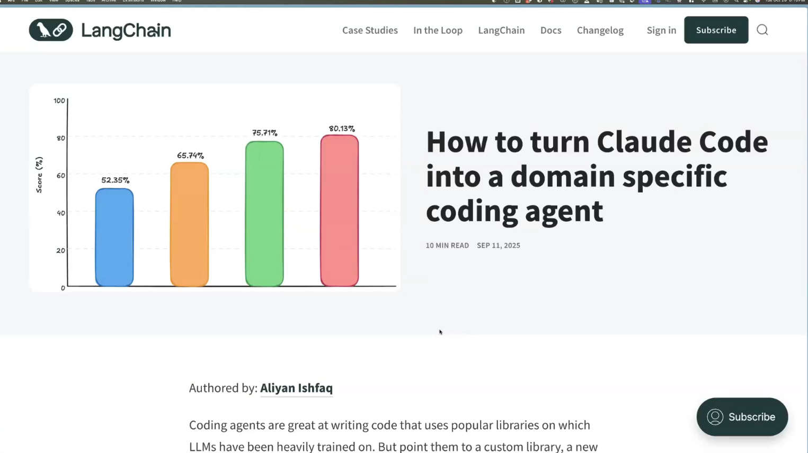
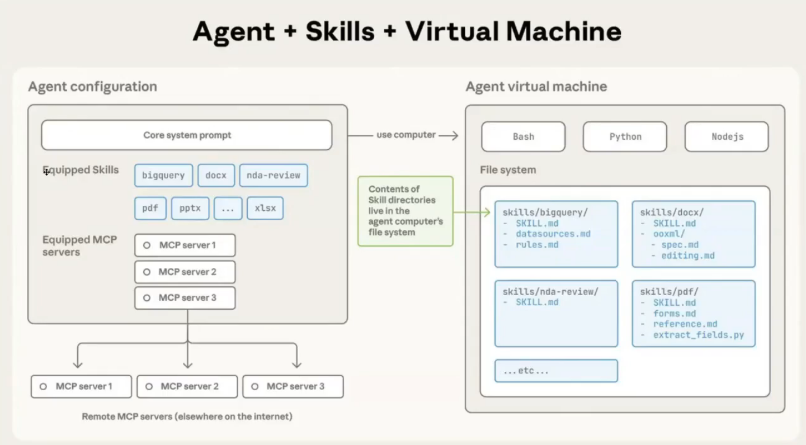
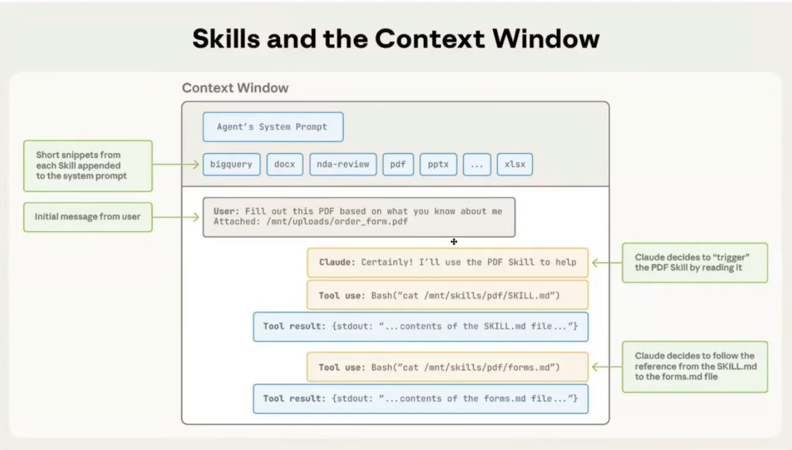
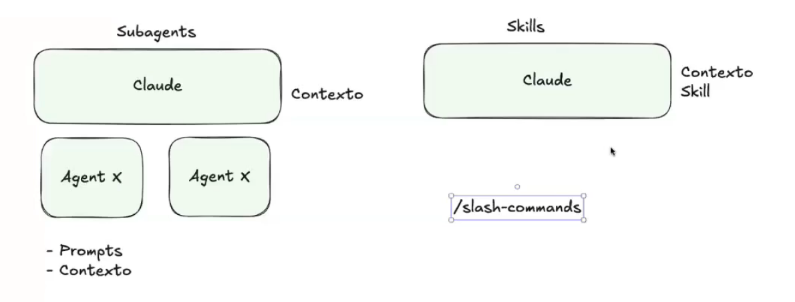

# Claude Code Skills
LangGraph Tasks

https://blog.langchain.com/how-to-turn-claude-code-into-a-domain-specific-coding-agent/

Claude Code Skills

Claude code Skills context window

# Diferenças entre Skills e subagents

Subagents:
- Contexto próprio, não usa o contexto do agente principal.
- Chance da janela de contexto estourar é baixa.

Skills: (Parece macro)
- Faz parte do contexto do agente principal
- Tarefas que são feitas o tempo todo (Commit, PR)
- Lazy-Loading
- Skill pode executar software
- Skill pode segregar contexto (Claude.md para angular / Claude.md para dotnet)
- Evita uso de fetch / curl (De recursos externos)

/Slash-commands
- Pode chamar skills

