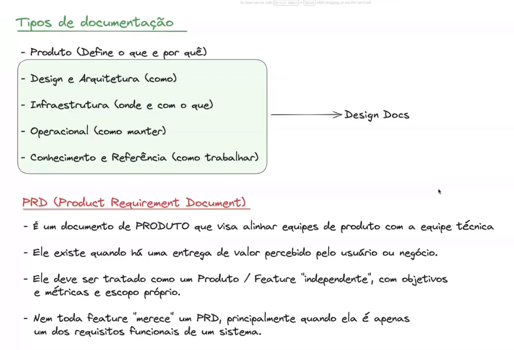
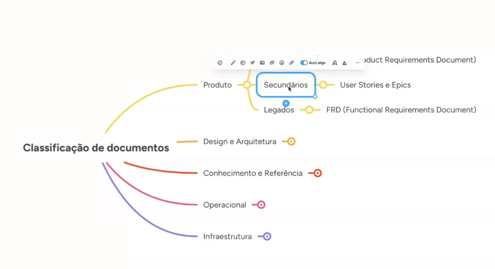
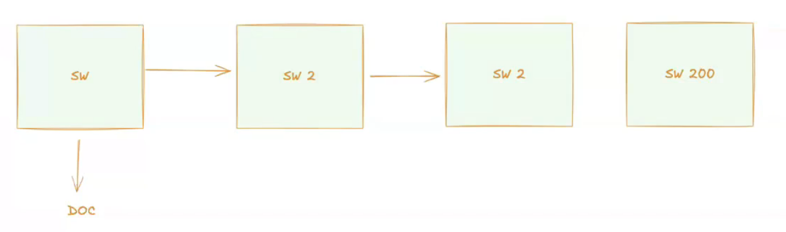

# Aula

Tipos de documentação
- Produto (Define o que e por quê)
- Design e Arquitetura (como)
- Infraestrutura (onde e com o que)
- Operacional (como manter)
- Conhecimento e Referência (como trabalhar)

→ Design Docs

PRD (Product Requirement Document)
- É um documento de PRODUTO que visa alinhar equipes de produto com a equipe técnica
- Ele existe quando há uma entrega de valor percebido pelo usuário ou negócio.
- Ele deve ser tratado como um Produto / Feature "independente", com objetivos e métricas e escopo próprio.
- Nem toda feature "merece" um PRD, principalmente quando ela é apenas um dos requisitos funcionais de um sistema.

Workflow
- Desenvolver
- Commitar / Release -> Prod
- Atualize a documentação baseado nos commits, XPTO, etc. etc.

Padronização
- Qual tipo de documento eu tenho que atualizar?
- Quando eu considero que houve uma mudança arquitetural relevante e que o desenvolvedor deveria ter criado uma ADR.
- Verificar se eu fiz alguma mudança arquitetural e não percebi
- Sistemas atuais e consigo extrair mudanças arquiteturais desse software -> Justificar baseado no negócio/estratégia/custo, etc
- Sistemas atuais e registrar decisões arquiteturais apenas em aspectos analíticos

---
---

# Pontos importantes

- Apenas um ponto de documentação e não replicar.
- Criar integração com confluence.
