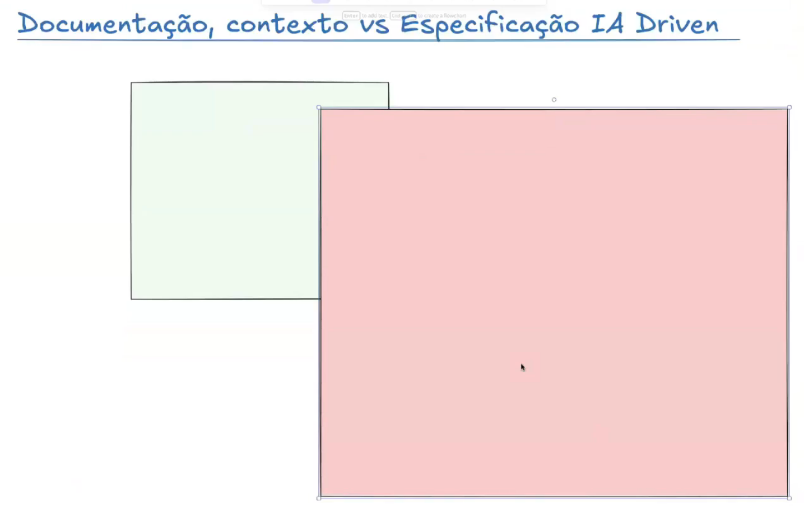

# Spec Driven Development (SDD)

- Metodologia onde se começa pela especificação "formal" da solução antes de qualquer código
- Contrato que descreve o que a aplicação deve fazer, para quem serve e quais requisitos não funcionais devem ser respeitados.
- Specs viram artefatos "vivos" que evoluem junto com o projeto e servem como fonte da verdade para devs e agentes de IA.
- IA gerando o código, testes e documentação a partir da especificação
- Humanos revisam, validam e refinam cada etapa.

---
### Ferramenta / Workflow / Biblioteca
---

# Visão de futuro (Opinião Pessoal)

- Sempre esteve muito claro de que documentação, especificações, tarefas, etc são a base para o novo processo de desenvolvimento de software

- Cada vez mais veremos ferramentas, metodologias, workflows para que facilitem esse processo

- NÃO acho que haverá pelos próximos tempos uma ferramenta coringa que consiga "resolver" todo o processo

- Cada projeto é um projeto, cada desenvolvedor é um desenvolvedor, e workflows de forma geral precisam ter personalizações por projetos e preferências pessoais

- Grande parte das ferramentas tendem a deixar de "fora" o lado subjetivo, estratégico e de produto

- Com tantas especificações e documentos, eventualmente fica quase inviável revisar as especificações.

- Sim, o código obviamente já verificamos e revisamos (ou deveríamos fazer), por outro lado, fazer uma revisão profunda na especificação e depois repetir o mesmo no código pode se tornar inviável.

- IA gerando o código, testes e documentação a partir da especificação.

- Humanos revisam, validam e refinam cada etapa.

# Problema
- Remove a pessoa técnica.
- Muita spec impossível de revisar.

# GitHub Spec Kit  
Projeto open source (https://github.com/github/spec-kit)

1. Constitution - Princípios inegociáveis do projeto  
2. Specify - Foco no "O que" e o "Porquê" do projeto (não é relacionado a tecnologia em si)  
3. Plano de implementação (técnico) - Stack, decisões arquiteturais, etc...  
4. Tarefas - Lista de tarefas baseadas no plano de implementação  
5. Implementação - Execução das tarefas de acordo com o plano