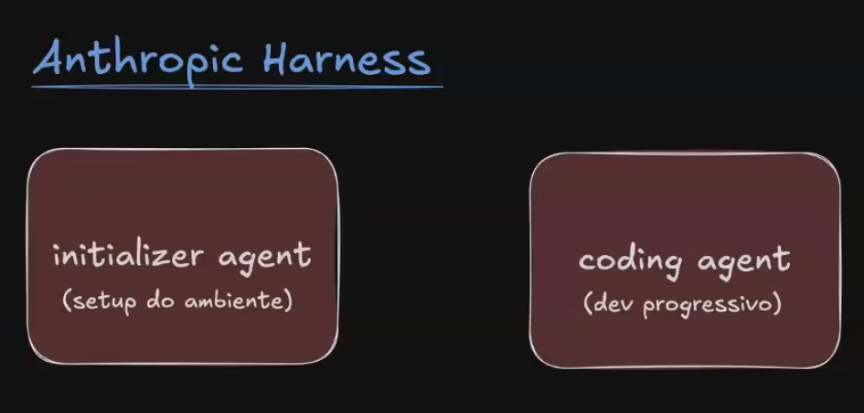
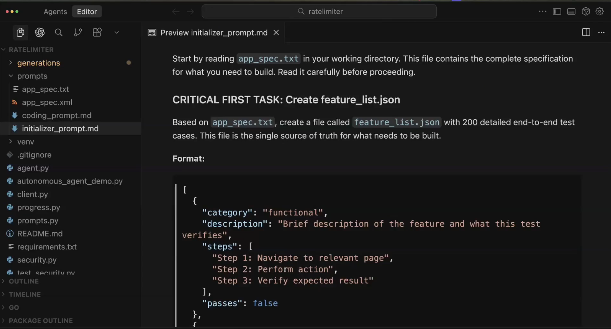
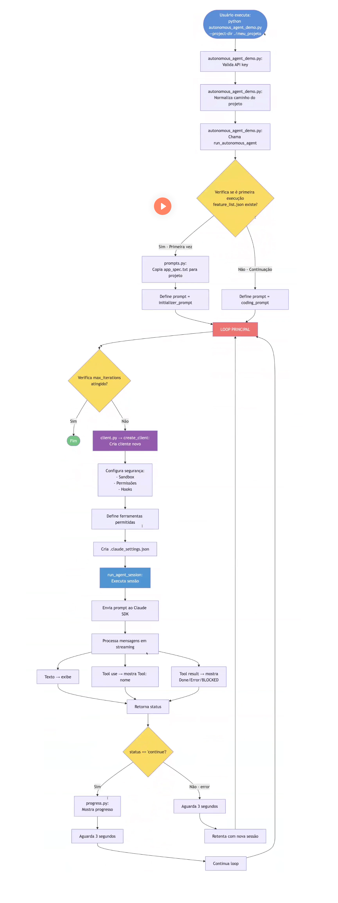
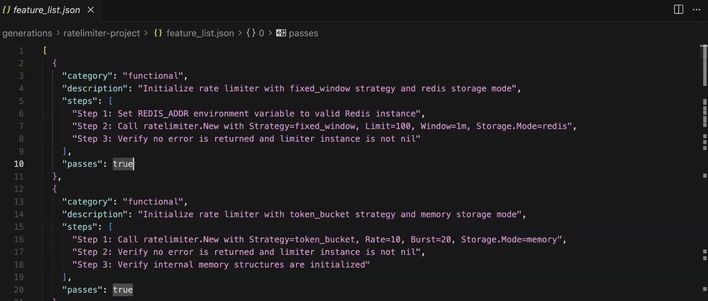
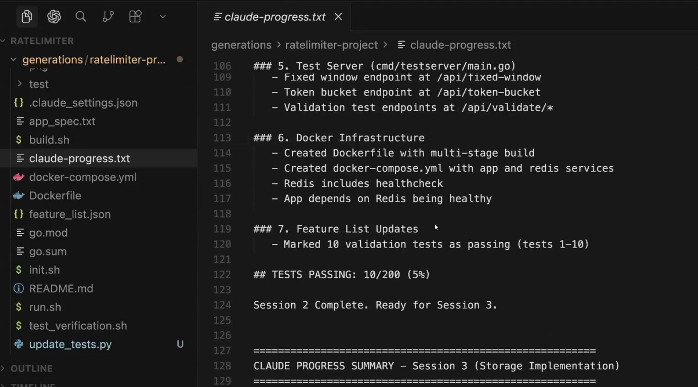

# Harnesses for long-running agents

## O que é Harness?
- Estrutura de controle
- Um conjunto de ferramentas, processos e controles externos que suportam um sistema e garantem que ele siga regras determinadas.

## Exemplos
- Test Harness
- Simulation harness
- Build harness
- Agent harness

# Problemas conhecidos e assumidos (Problemas de contexto)

- Compactação não é o suficiente
- Agente tentar fazer muita coisa de uma vez só (principalmente em one-shot)
- Features feitas pela metade sem documentação
- Agente inicia, verifica o projeto de uma "feature" parcialmente implementada e acredita que já terminou.



Dicas: Tente desenvolver sempre usando containers


# Initializer agent

Prompt para o modelo fazer o setup inicial do ambiente
- init.sh
- claude-progress.txt
- git

# Coding agent

Faz o progresso incremental a cada sessão  
Updates estruturados


# Features

```json
{
  "category": "functional",
  "description": "Fixed Window: limitar requisições por minuto para um usuário",
  "steps": [
    "Configurar limite de 60 requisições por minuto",
    "Enviar 60 requisições dentro do mesmo minuto",
    "Verificar que as 60 requisições são aceitas",
    "Enviar a requisição número 61 no mesmo minuto",
    "Verificar que é bloqueada e retorna informação de retry-after"
  ],
  "passes": false
}
```

### Json > Markdown 
A chance da IA fazer besteira com json ou ton, é muito menor que em um markdown por conta da estrutura rígida. IA gosta de padrão.

Dica: Utilisar git log ou git diff, para pegar o histórico como contexto.

# Desenvolvimento incremental
- Commit com descrições claras do que foi feito
- Resumo do que foi feito em um arquivo de progresso (State)

# Testing
- Prompt explícito para testes
- Não limitar as possibilidades: Unidade, integração, End-to-end, browser, etc
- Resumo do que foi feito em um arquivo de progresso (State)


# Inicialização de qualquer agente

"1. Run pwd to see the directory you're working in.  
    You'll only be able to edit files in this directory.

2. Read the git logs and progress files to get up to speed on what was recently worked on.

3. Read the features list file and choose the highest-priority feature that's not yet done to work on."


# Claude Agent SDK != Claude Code CLI

## Claude Agent SDK
- Biblioteca Python/TypeScript para criar agentes de IA autônomos
- Permite integrar capacidades do Claude em aplicações próprias
- Fornece APIs para construir agentes que executam tarefas complexas

## Como funciona
- Gerenciamento de contexto: compactação e gestão automática do contexto
- Ferramentas: operações de arquivo (Read, Write, Edit), execução de código (Bash), busca
- Extensibilidade via MCP (Model Context Protocol): integração com bancos de dados, APIs
- Hooks: execução de código antes/depois de eventos (ex.: validação de segurança)
- Subagentes: criação de agentes especializados

```python
return ClaudeSDKClient(
    options=ClaudeCodeOptions(
        model=model,
        system_prompt="You are an expert full-stack developer building a production-quality web application.",
        allowed_tools=[
            *BUILTIN_TOOLS,
            *PUPPETEER_TOOLS,
        ],
        mcp_servers={
            "puppeteer": {"command": "npx", "args": ["puppeteer-mcp-server"]}
        },
        hooks={
            "PreToolUse": [
                HookMatcher(matcher="Bash", hooks=[bash_security_hook]),
            ],
        },
        max_turns=1000,
        cwd=str(project_dir.resolve()),
        settings=str(settings_file.resolve()),  # Use absolute path
    )
)
```


Exemplo:


Spec com XML


# Workflow:




## Examplp de arquivo de features state. (Kanban)


## Estado do projeto



## Sources:

https://www.anthropic.com/engineering/effective-harnesses-for-long-running-agents

https://medium.com/@fruitful2007/agent-harness-understanding-claude-codes-superpower-engine-85e35a7ec764

https://docs.github.com/en/copilot/concepts/agents/coding-agent/about-coding-agent

https://docs.github.com/en/copilot/how-tos/copilot-sdk/sdk-getting-started