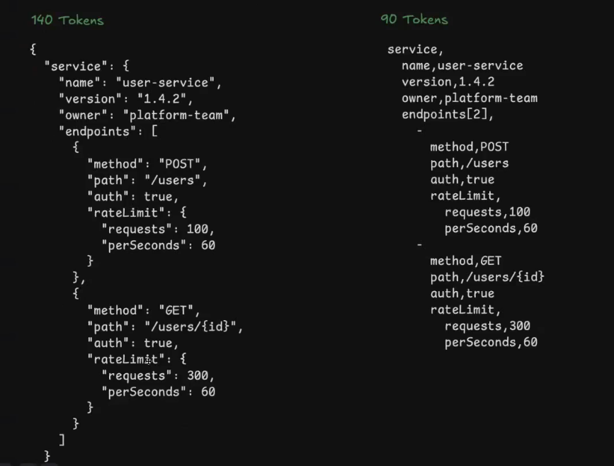

# Repository intelligence

- Estrutura
- Histórico
- Padrões recorrentes
- Decisões passadas
- Usa isso ativamente para orientar mudanças futuras

# Hoje (2025)
- árvore de diretórios
- módulos e boundaries
- dependências internas
- padrões de naming
- convenções básicas

# Histórico (tendência para 2026)
- histórico de commits
- PRs rejeitados vs aceitos
- refactors anteriores
- bugs recorrentes
- decisões revertidas

**Ex:** Essa otimização já foi tentada em março e teve rollback por gerar race condition.

**O agente aprende com o passado, não só com o estado atual!**

# "Memória corporativa"

- Um sistema que captura, mantém e reaplica o conhecimento acumulado da organização, não de um único desenvolvedor.
- Memória curada pelo trabalho da equipe
- Memória por repositório, projeto, org.

**ex:**  
Regras não documentadas:
- Qual mudança gerou um incidente
- Como foi resolvido

**Code review:**  
Agente comenta: Essa modificação viola o padrão adotado após o incidente XPTO

# IDEs

- Agentes em paralelo (Início no final de 2025) — ex: cursor 2.0
- "Agent Manager": Orquestra diferentes agentes específicos em tarefas específicas de forma concorrente
- Workflows E2E (desenvolver, compilar, testar, deploy) — testes e desenvolvimento usando cada vez mais ferramentas da máquina do usuário (browser)
- Artefatos automáticos (Antigravity): Planos, diffs, screenshots, logs, testes, históricos para cada ação.
- Melhor integração com browsers facilitando UI / Frontend + backend + testes em loop
- Contexto permanente + memória do projeto + history-aware agents (histórico contextual do projeto, além de versionamento do código)
- Agent First

# Spec Driven Development (SDD)

- Utilizar a especificação como fonte única da verdade (grande desafio está como adaptar para cada tipo de projeto)
- Projeto de referência: Github Spec Kit
- Iniciativas internas de grandes empresas

# Spec-as-source (SDD 2.0)

- Especificação é a fonte da verdade (artefato primário) e o código, testes e documentação são derivados dela
- Código é gerado
- Código não é mais editado manualmente
- Mudança na Spec -> Código gerado novamente.

# Formato de dados

- Ex: TOON (Token-Oriented Object Notation)
- Pode reduzir de 30–60% dos tokens em relação ao JSON
- Frameworks e bibliotecas já iniciaram diversas implementações

# Observabilidade além de anomalias

- Root Cause Analysis assistido por IA
- Logs e traces: IA resumem logs, destacam eventos e agrupam erros semanticamente
- Observabilidade orientada a eventos e mudança (o que mudou antes do incidente)
- Sistemas com IA (latência, custo por chamada, tokens, falhas, degradação de qualidade percebida)
- Geração automatizada de dashboards
- Runbooks assistidos e automação parcial (alerta com passos sugeridos, comandos recomendados, correções automatizadas)
- Menos alertas e mais contexto (menos ruído)
