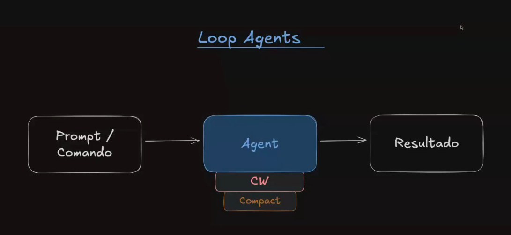
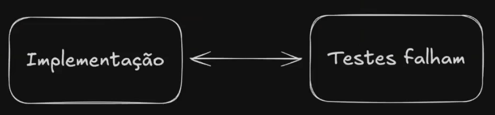
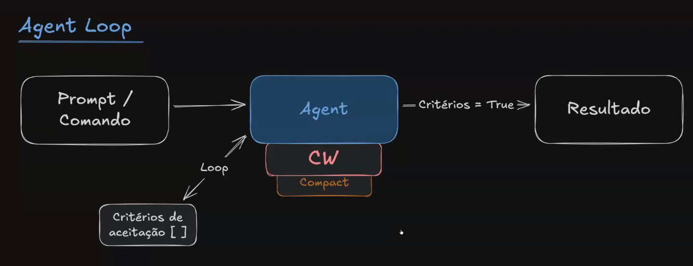
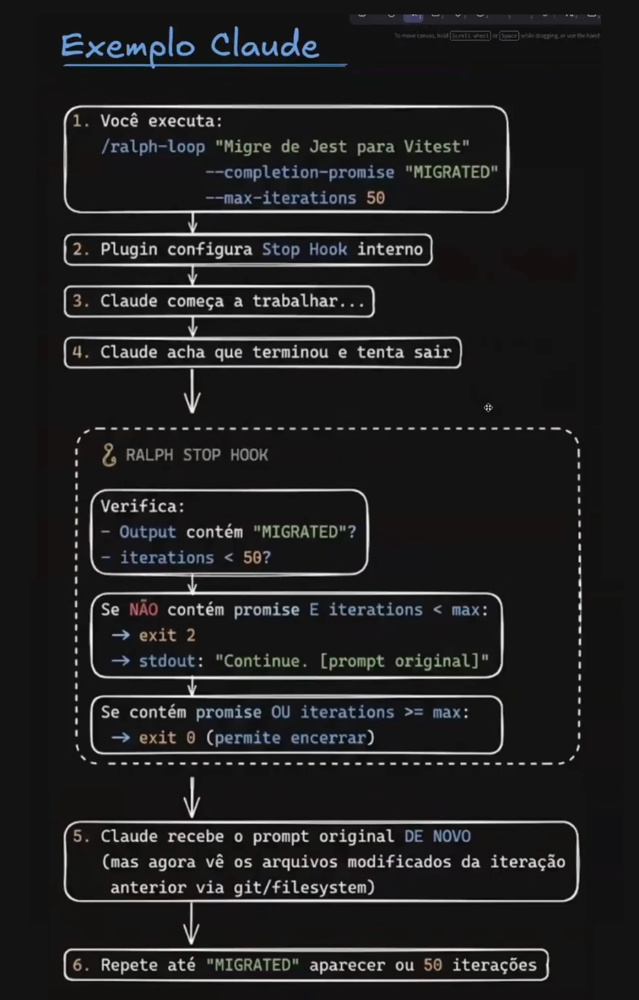
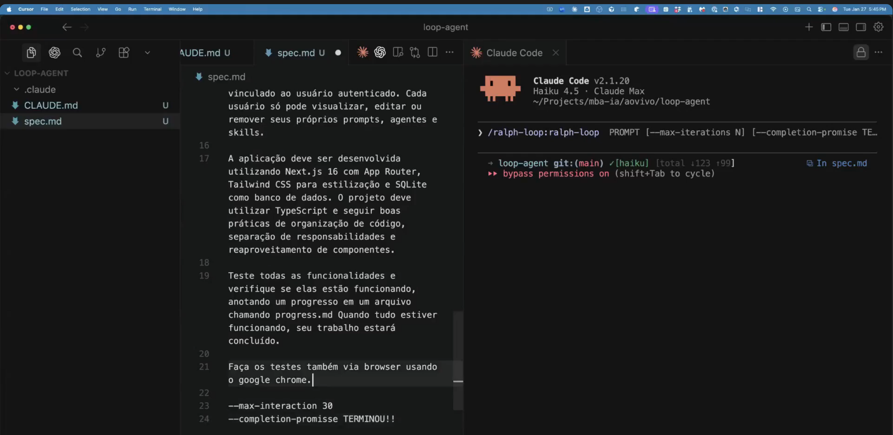
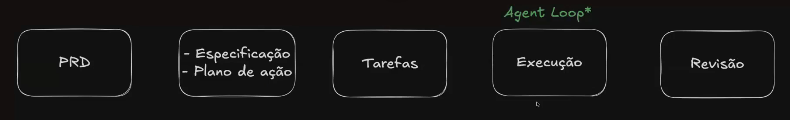
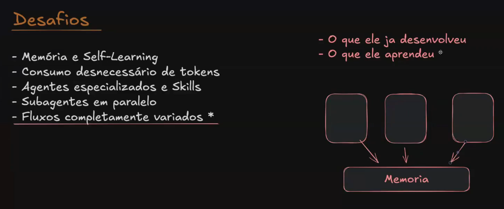
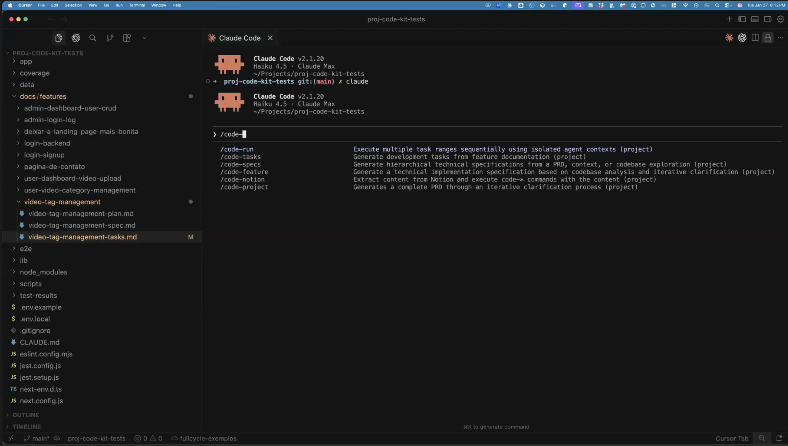
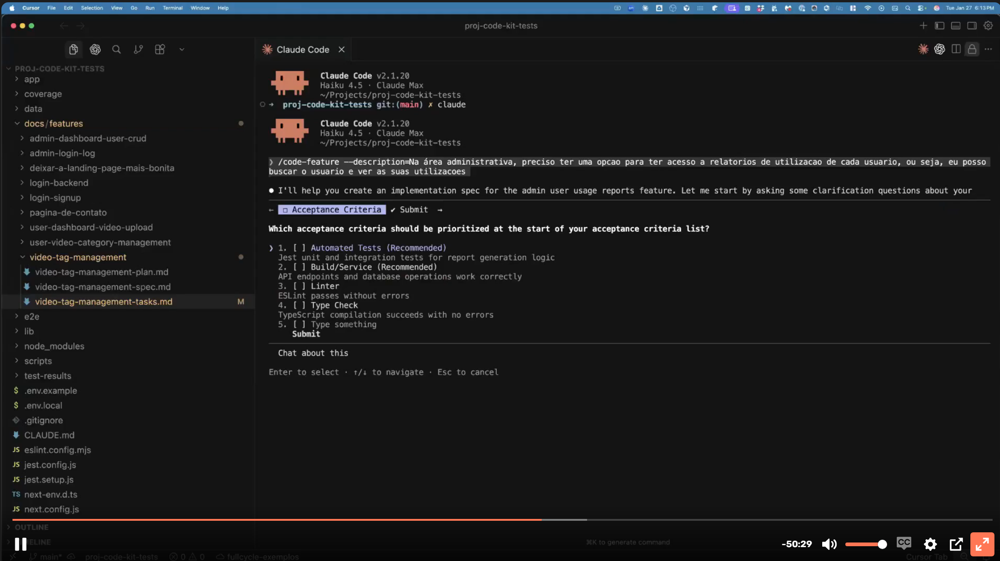
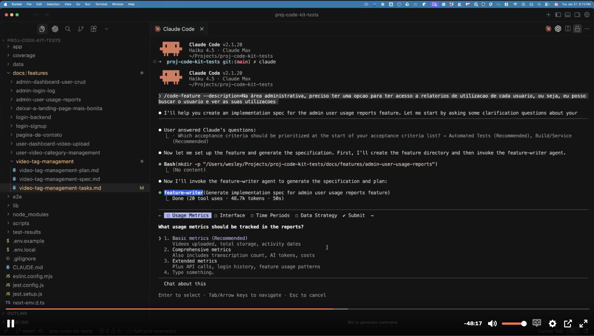

- Geoffrey Huntley
- Ralph Wiggum dos Simpsons: Ignorância + persistência + otimismo. Lembra de alguém??

"Quando descobri isso em fevereiro, literalmente me fez querer vomitar porque eu podia ver onde estávamos indo. Eu estava construindo software enquanto dormia. Eu ando por aí e vejo pessoas mortas, tipo O Sexto Sentido. Não que estejam literalmente mortas, só que ainda não sabem que não têm mais emprego."



# Técnica original  
**"Ralph is a Bash loop"**  
https://github.com/ghuntley/how-to-ralph-wiggum

```bash
while :; do cat PROMPT.md | claude-code ; done
```

- Sem instalação
- Persistência via git + arquivos de progresso
- Executa com qualquer ferramenta que não limite tool calls
- "Naive persistence": feedback não sanitizado


- Stack trace completo (50+ linhas)
- Warnings do compilador
- Output do linter
- Mensagens de deprecation
- Erros de dependência
- TUDO que o terminal cuspiu




# Plugin Oficial Anthropic (ralph-wiggum)

**Comandos:**
/ralph-loop "<prompt>" --completion-promise "DONE" — Inicia o loop  
/cancel-ralph — Cancela o loop ativo

Flow:
# SessionStart → Sessão inicia

# PreToolUse
ANTES de usar qualquer ferramenta (read file, write file, bash, etc)

# PostToolUse
DEPOIS de usar qualquer ferramenta

# Notification
Quando Claude quer notificar algo
# Stop
Stop → Quando Claude tenta encerrar a sessão

# Stop Hook

- Desenvolva uma função de somar
- Claude inicia o trabalho
- Claude: "Pronto, fiz a função"
- Claude tenta encerrar...

**Stop HOOK Intercepta**
- Execute o script XPTO
- Script retorna:
  - Exit code 0 → Permite encerrar
  - Exit code 2 → BLOQUEIA + injeta nova mensagem

**Se exit code 2:**
- Claude recebe mensagem injetada e CONTINUA trabalhando

- Loop executa até hook retornar 0 (Zero)

---




---




# Spec Driven Development

- Metodologia onde a especificação é o artefato primário, e o código é sua expressão
- Inverte o fluxo tradicional: ao invés de "code first, document later", é "specify first, code after"
- A spec funciona como contrato entre humano e IA (ou entre membros da equipe)
- Intent-driven: a intenção é expressa em linguagem natural, código é "last-mile"

### Flow SDD
PRD → Especificação → Plano de ação → Tarefas → Execução (Agent Loop) → Revisão


          
          
# Desafios

- Memória e Self-Learning
- Consumo desnecessário de tokens
- Agentes especializados e Skills
- Subagentes em paralelo
- Fluxos completamente variados *




## Exemplo do projeto do wesley









# Dicas
Estudar git worktree = Trabalhar em várias branches diferentes em um mesmo repo.