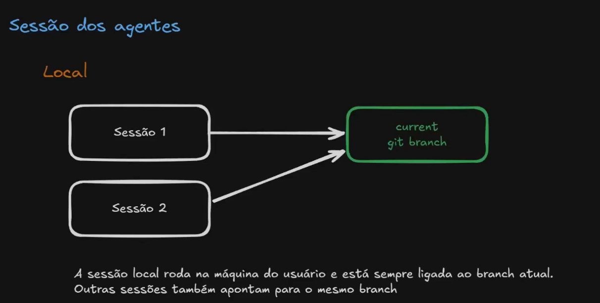
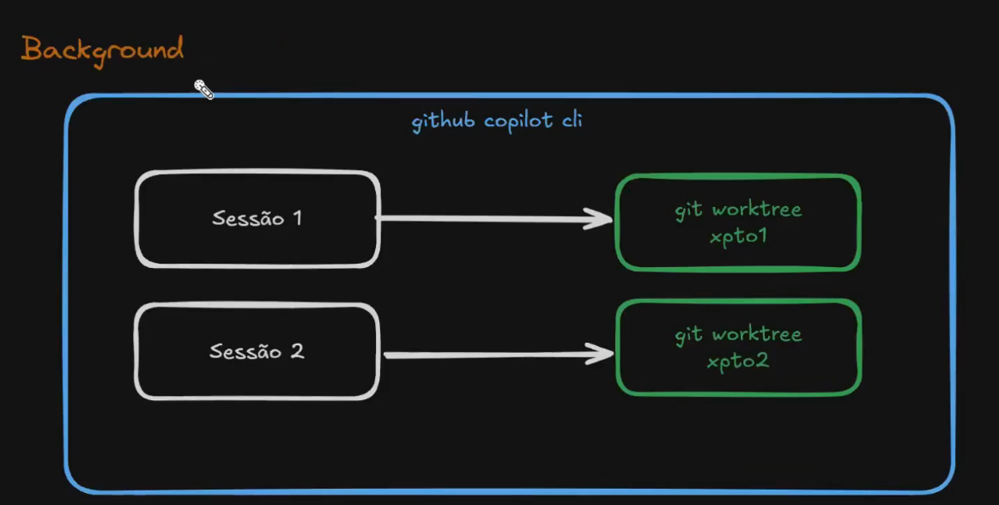
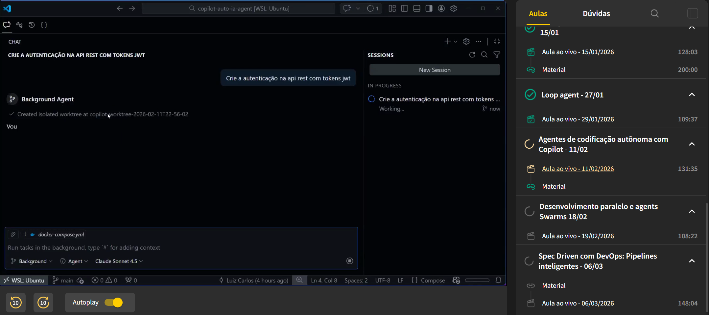
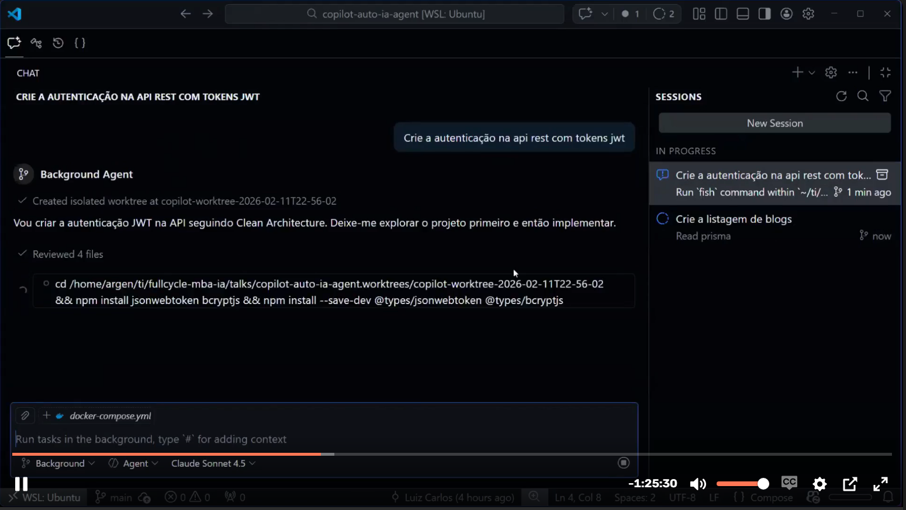
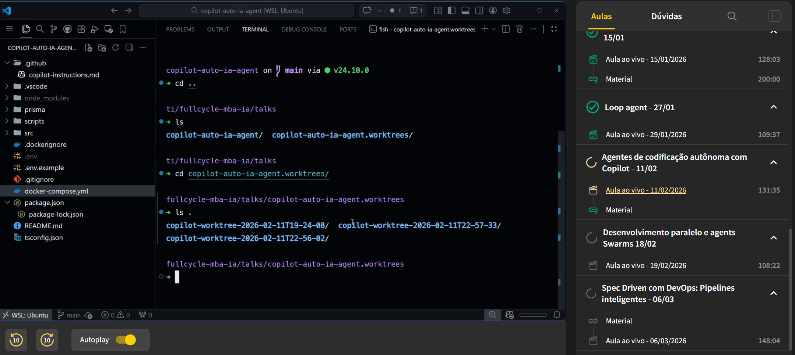
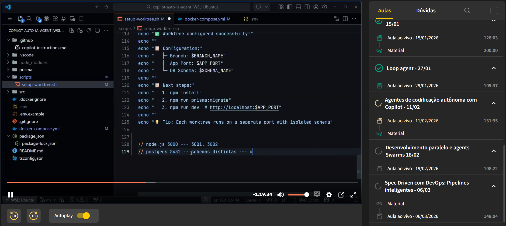
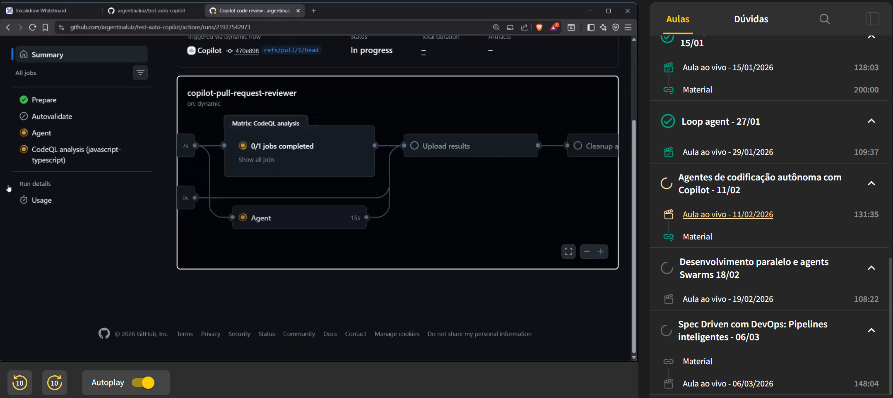

# Agentes de codificação autonoma com Copilot

# git worktree
Conceito: git worktree permite ter múltiplas cópias de trabalho (diretórios) ligadas ao mesmo repositório Git, cada uma com seu branch checado. Útil para desenvolver paralelamente em branches diferentes sem precisar clonar de novo.

## Branch 
É um ponteiro/ref no Git (aponta para um commit).

## Worktree 
É um diretório de trabalho adicional ligado ao mesmo repositório, onde você pode checar um branch (ou um commit em detached HEAD).

## Copilot

### O problema é o conflito de portas e recursos

## Github Coding agents
Rodar direto no github.com

## Github Review
