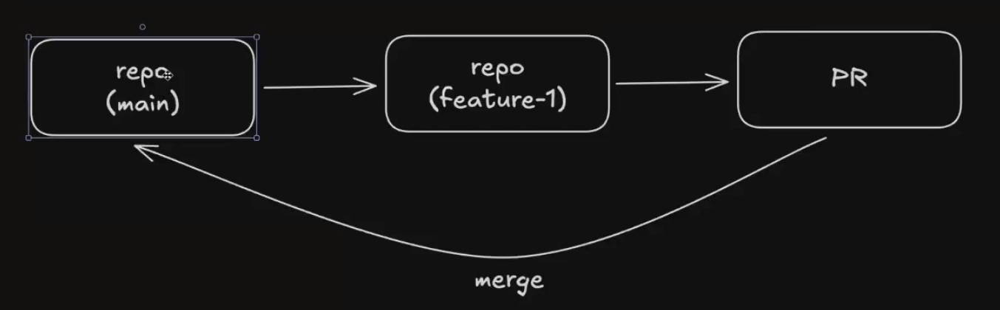
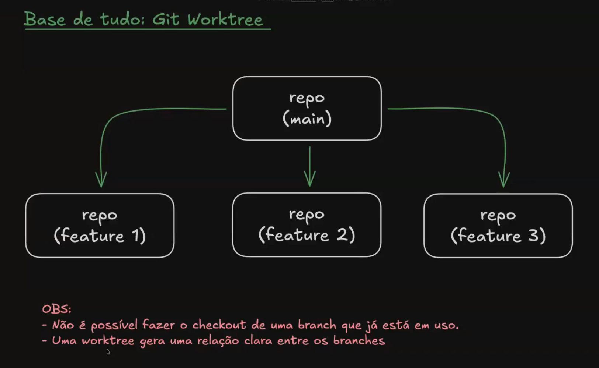
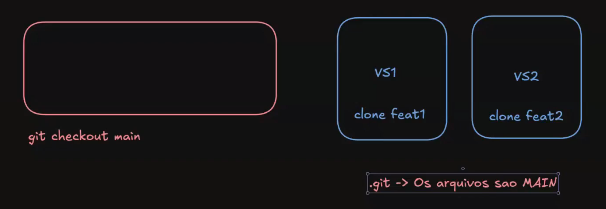

# Desenvolvimento paralelo

## Formato tradicional de desenvolvimento (com ou sem IA)
repo (main) → repo (feature-1) → PR  
↳ merge

## Com utilização eficiente de desenvolvimento com IA:
- Desenvolvimento simultâneo / paralelo de diversas features
- Acompanhamento em tempo real de logs, commits
- Ambiente de execução (local / remoto)

## Git Worktree
Cada pasta aponta para uma branch.

### Soluciona o problema de trabalhar com branches.
Se eu apago uma worktree, não apago o branch

# Agentes autônomos (sem human in the loop)

- Agente precisa ter liberdade para desenvolver e realizar seus commits
- Evitar interrupção e interações com o usuário
- Testabilidade e codereview por outros agentes
- Especificações, regras claras, tarefas, guidelines, etc.

# Acompanhamento em tempo real

- Desenvolvedor pode acompanhar em tempo real o agente realizar o desenvolvimento (não "recomendo")
- Podemos acompanhar os logs e processos em execução, muitas vezes é extremamente útil
- TMUX

# Desenvolvedor como "last mile"

- Após a conclusão das tarefas, o desenvolvedor fará correções, resolverá problemas
- Possivelmente trabalhará em conflitos

#