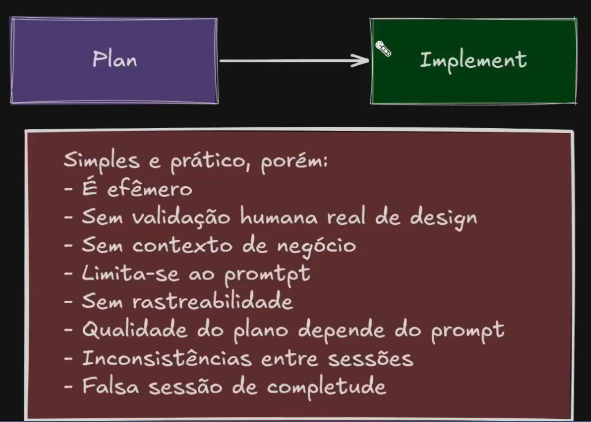
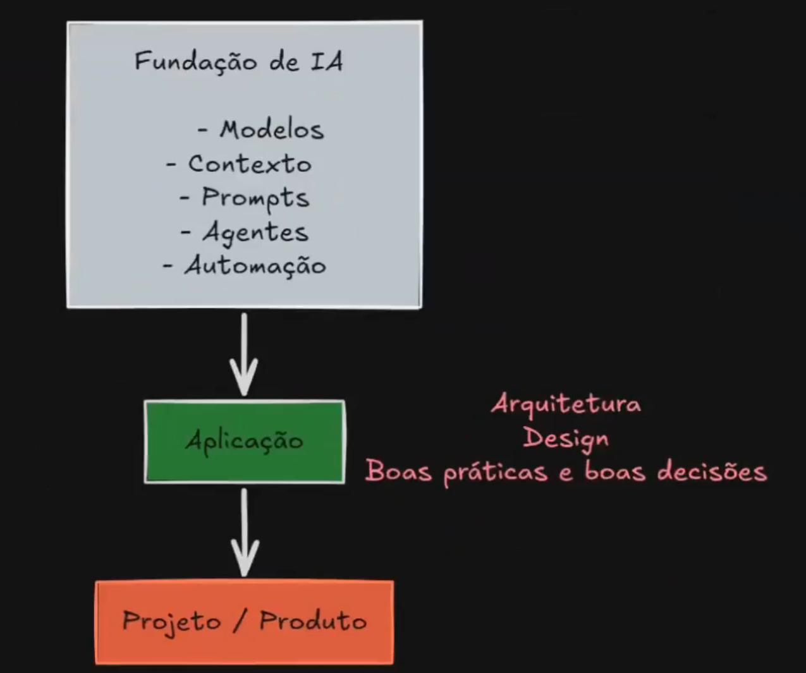
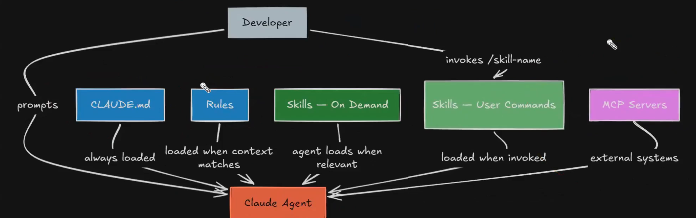
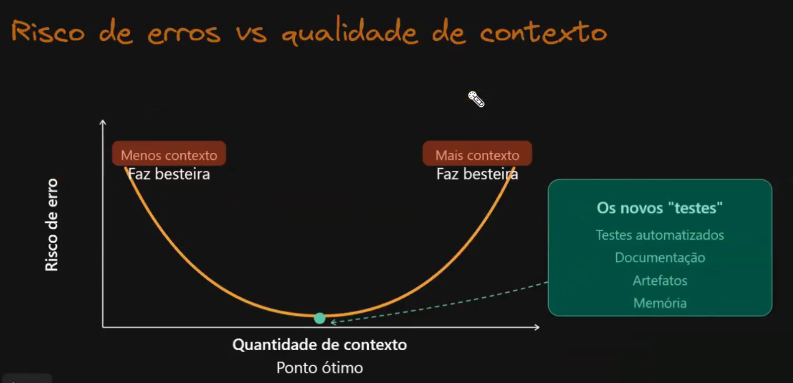

## Workflow de desenvolvimento com IA

## Worflow Plan --> Implement

## Workflow com Design First

## Fundação da IA

## Artefatos de fundação com Claude Code / Copilot

## Claude Code Configurations (How artefacts helps)

## Engenharia de contexto

------------
Não terminei a aula.
Pulei para assistir o material normal.