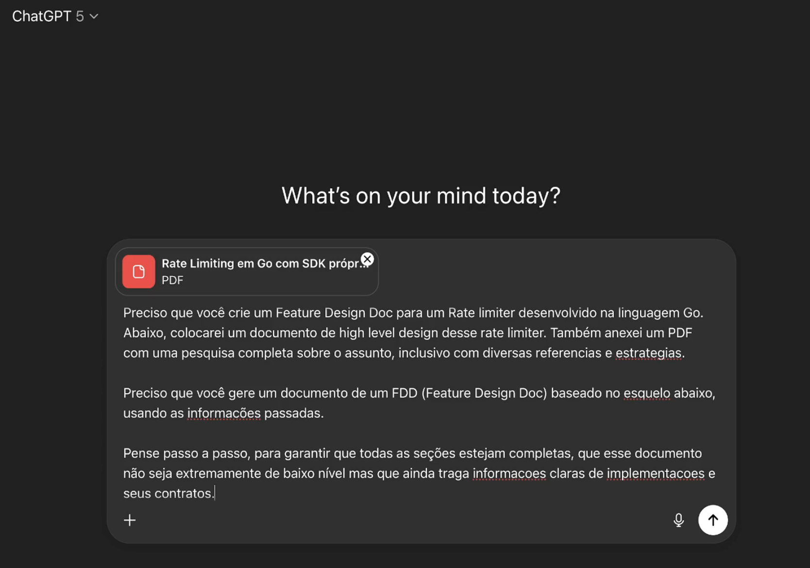

### Gerando FDD a partir do Deep Research

- Entra no ChatGPT

- nexa o arquivo com a documentação:
[Rate Limiting em Go com SDK próprio e suporte a Multi‑Tenancy.pdf](attachment:0d6d53b3-a76b-4bd7-866d-278f0b02cb2c:Rate_Limiting_em_Go_com_SDK_proprio_e_suporte_a_MultiTenancy.pdf)

-Faz um prompt

- Colando o High Level Document (HLD)
[HLD (Rate Limiter)](https://www.notion.so/HLD-Rate-Limiter-2981423c0388803c904ac92eeb11a049?pvs=21)

- No final, pede a saída no formato no prompt de geração de HLD
[Prompt para geração de um HLD](https://www.notion.so/Prompt-para-gera-o-de-um-HLD-29e1423c0388802e98dec48b415a98f2?pvs=21)
