# Design Docs: Design & Arquitetura

Importante lembrar que cada empresa, times podem tratar tipos de Design Docs que têm o mesmo objetivo com nomes diferentes ou com outras variações de estrutura.

Entender o conceito por trás de um documento acaba sendo mais importante do que o nome em si.

## Documentos comuns
- HLD (High Level Design) - Como o sistema é estruturado
- Feature Design Doc - Como uma feature específica será implementada
- LLD (Low Level Design) - (Detalhes de implementação. ex: Contrato de uma API)
- ADRs (Architecture Decision Record) - Registram decisões arquiteturais ao longo de todo processo
- RFCs (Request for Comments) - Propõe o que será criado ou alterado (discussão do "como" e coleta de feedback)

## HLD (High Level Design)

Fornece um panorama macro, a arquitetura geral e as principais relações entre componentes.

Responde perguntas do tipo:
- Como o sistema é estruturado?
- Quais componentes/módulos existem e como se comunicam?
- Quais tecnologias e padrões sendo adotados?

---

---

# Diagramas C4

É um modelo para representar a arquitetura em diferentes níveis de detalhe. Ele organiza a visualização de como o sistema se relaciona com usuários e sistemas externos, quais containers o compõem, como cada parte interna é estruturada e, se necessário, como o código está organizado. Essa estrutura também facilita para agentes de IA entenderem o contexto do sistema, permitindo análise, refatoração e geração de artefatos técnicos com mais precisão.

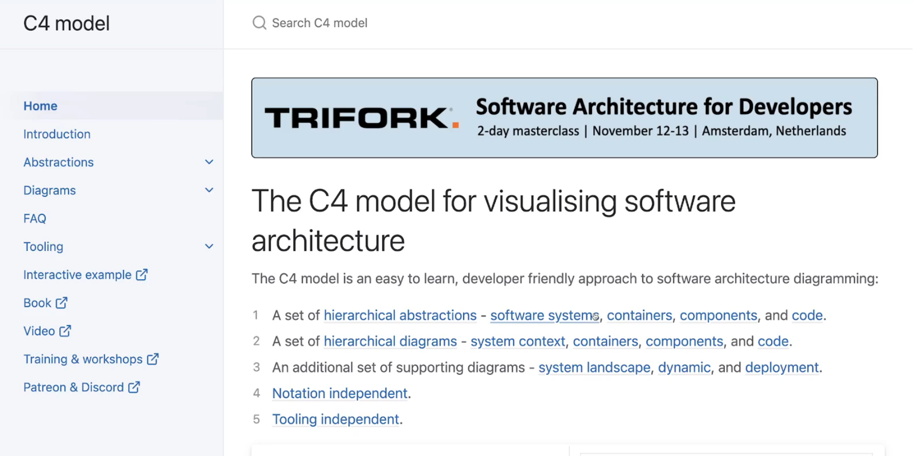

## C1: System Context (visão externa)

- Define o sistema no ambiente em que ele opera
- Identifica usuários, consumidores e integrações externas
- Bom para alinhamento entre diferentes times como: desenvolvimento, produto, segurança, etc.

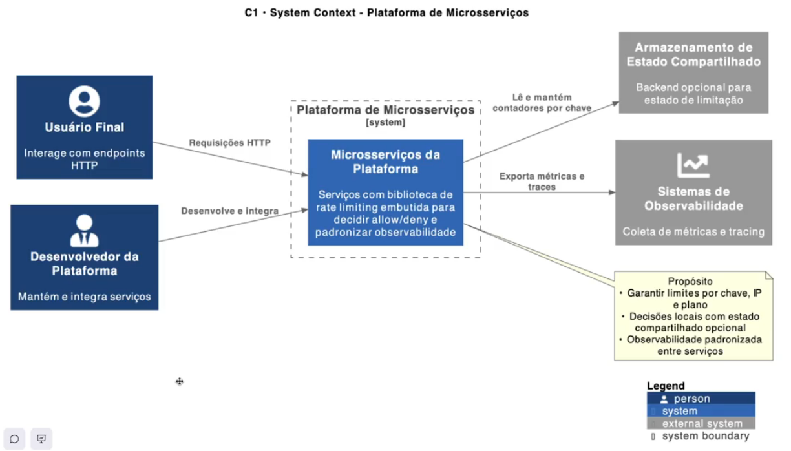

## C2: Container (arquitetura geral)

- Agrupa os principais blocos: serviços, aplicações, bancos, filas, APIs
- Evidencia como esses blocos se comunicam e em quais protocolos
- Ajuda em decisões de infraestrutura, escalabilidade e deploy

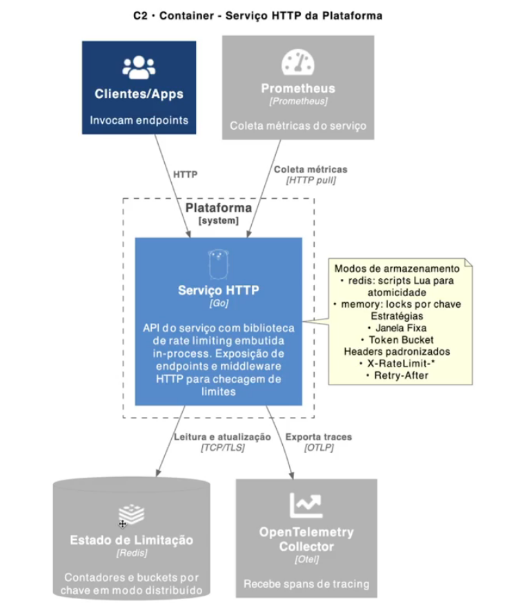

## C3: Component (estrutura interna)

- Organiza cada container em módulos, pacotes ou camadas
- Deixa claro onde estão as responsabilidades
- Auxilia devs a manterem coesão e reduzirem acoplamento

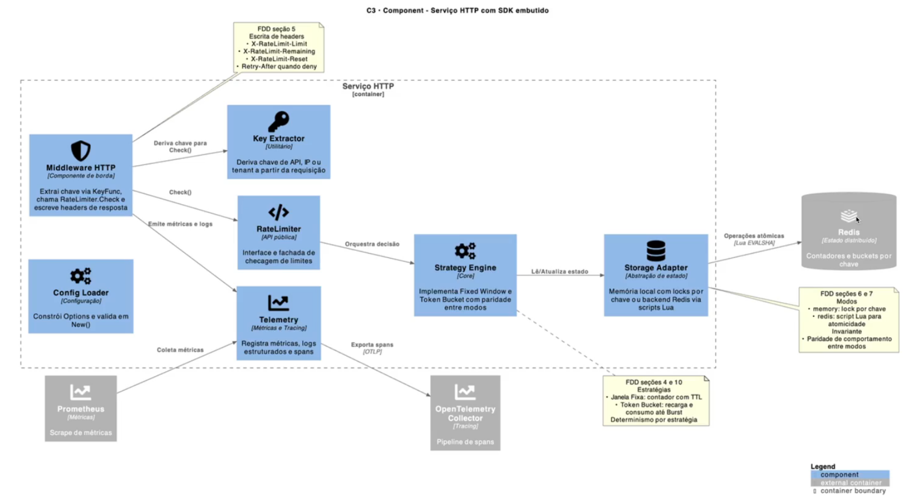

## C4: Code (detalhe técnico - código)

- Aprofunda em classes, funções ou estruturas específicas
- Usado apenas quando há necessidade real de padronização ou auditoria
- Não é obrigatório na maioria dos projetos
* Gerou a partir do FDD

## Prompts e Agentes - Implementação com Plant UML
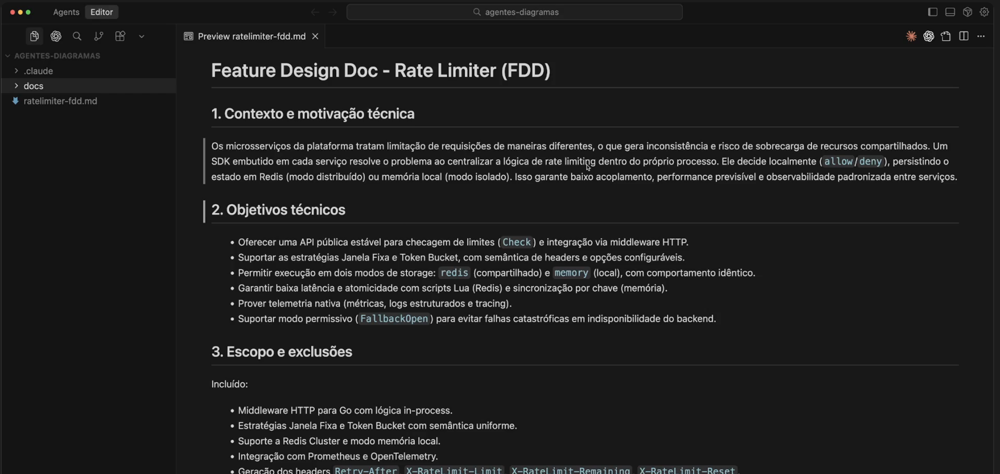
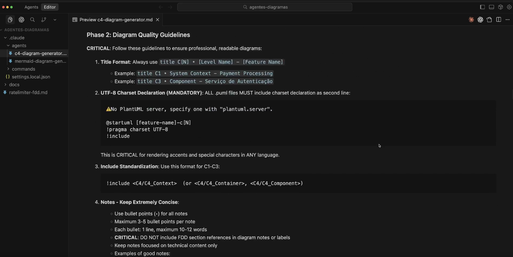

## Gerando diagrama C4
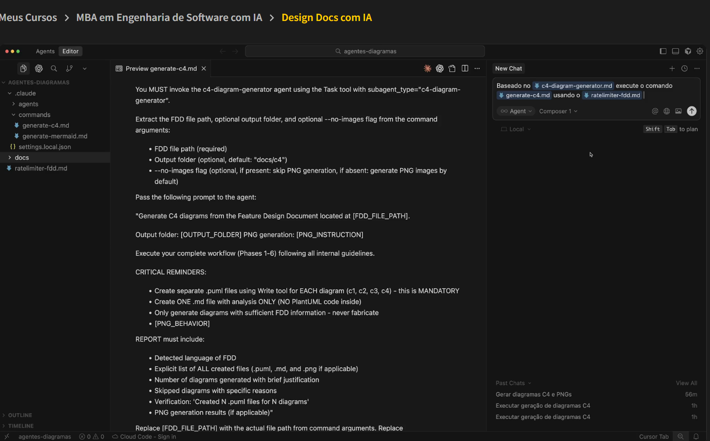
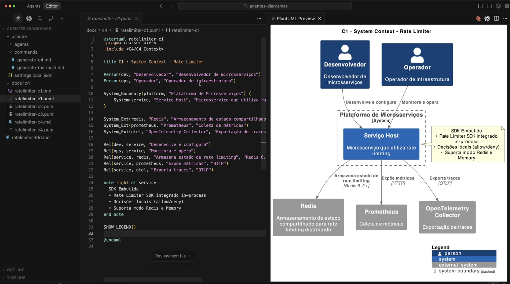
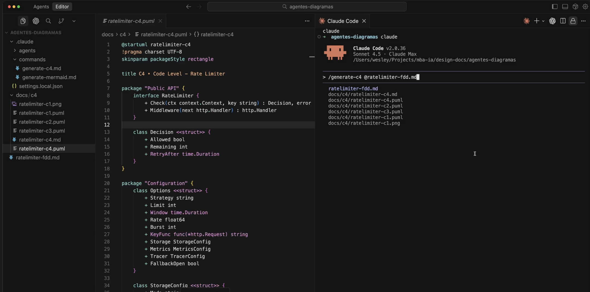

*???
Criar Hooks para verificar o FDD após uma mudança de código.
E a partir do FDD, verificar se os diagramas ainda fazem sentido.

## Diagramas Marmaid

Mermaid é uma linguagem de marcação que transforma texto em diagramas. Ela permite representar fluxos, interações e estruturas de sistemas de forma simples e legível dentro de documentos técnicos. Por gerar gráficos diretamente do código, facilita a manutenção, revisão e automação por agentes de IA, tornando a documentação sempre atualizada e consistente.

## Flowchart (Fluxograma) - Diagramas Marmaid

- Representa fluxos de decisão, etapas e caminhos alternativos
- Ideal para mostrar lógica de processos e pipelines
- Útil em documentações de sistemas, APIs e automações

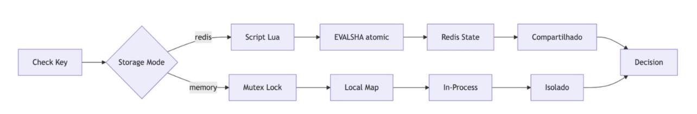

## Sequence Diagram (Diagrama de Sequência)

- Mostra a troca de mensagens entre componentes ao longo do tempo
- Excelente para visualizar chamadas entre serviços, APIs e bancos de dados
- Ajuda a identificar dependências e gargalos de comunicação

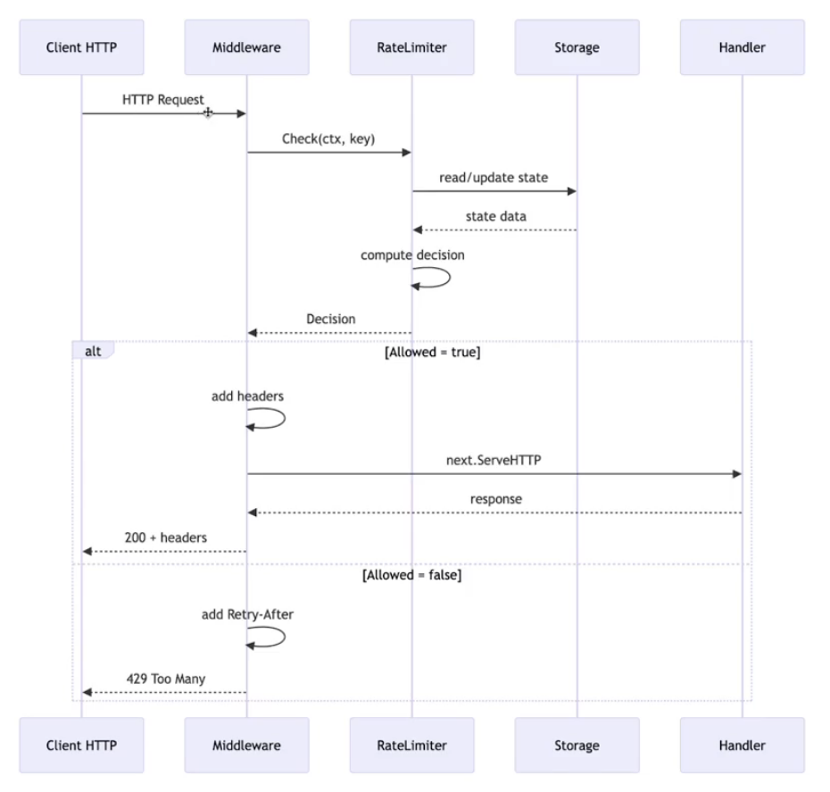

## Class Diagram (Diagrama de Classe)

- Exibe classes, structs e seus relacionamentos
- Mostra atributos, métodos e heranças
- Bom para explicar a estrutura interna do código e o design do domínio

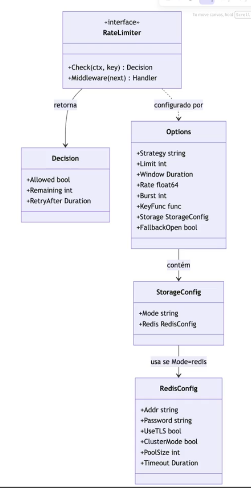

## ER Diagram (Entidade-Relacionamento)

- Exibe classes, structs e seus relacionamentos
- Mostra atributos, métodos e heranças
- Bom para explicar a estrutura interna do código e o design do domínio
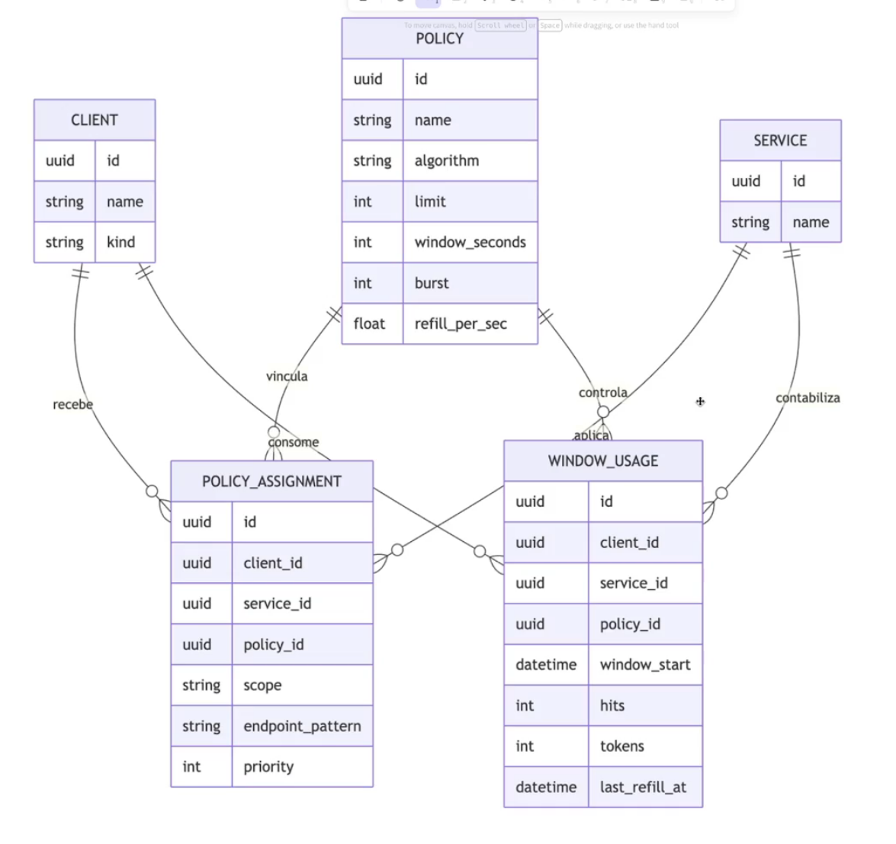

## State Diagram (Diagrama de Estados)

- Mostra os estados possíveis de um sistema e suas transições
- Indicado para workflows, automações e máquinas de estado
- Ajuda a entender como o sistema reage a diferentes eventos e condições
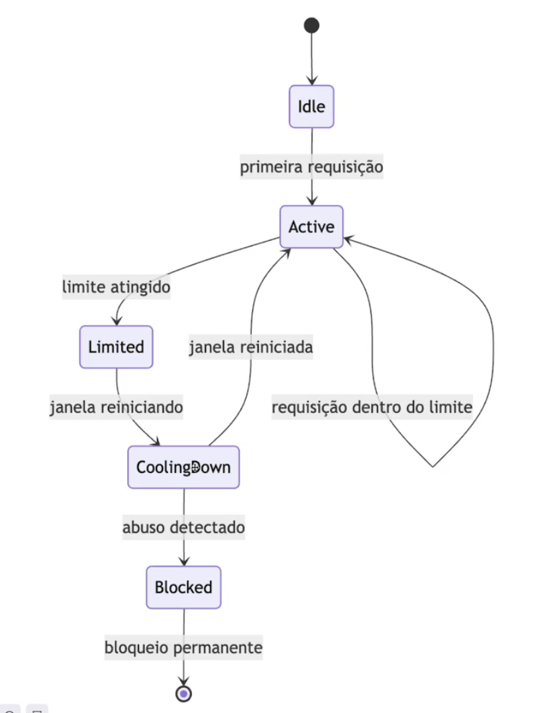

## PlayGround
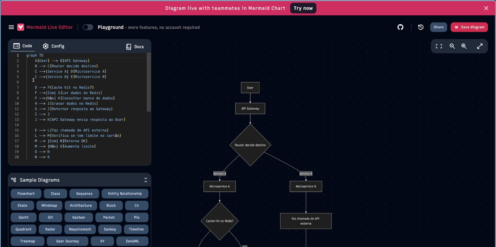

## Gerando Diagramas Mermaid com IA
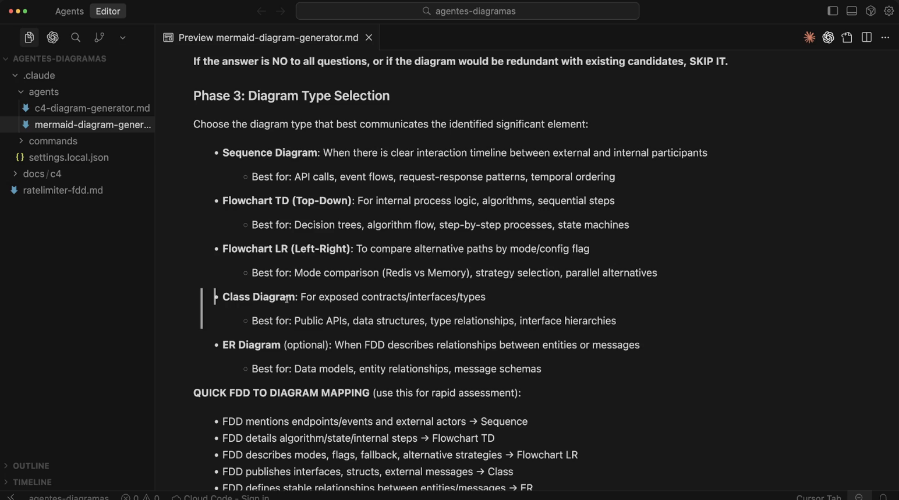

## Acesso aos Prompts