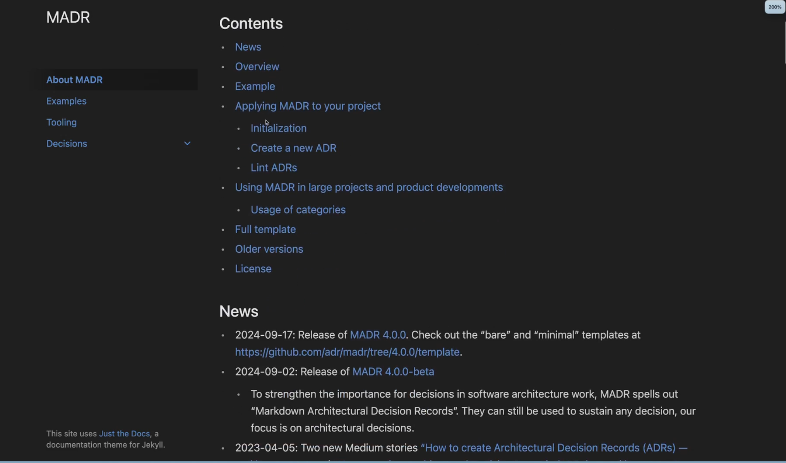
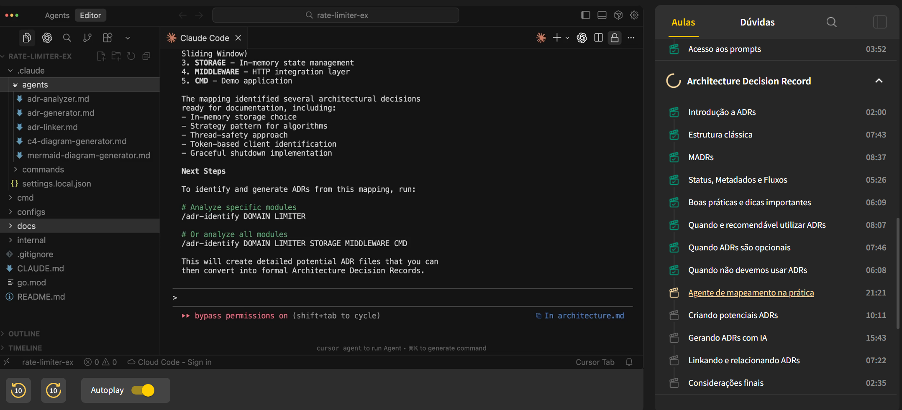
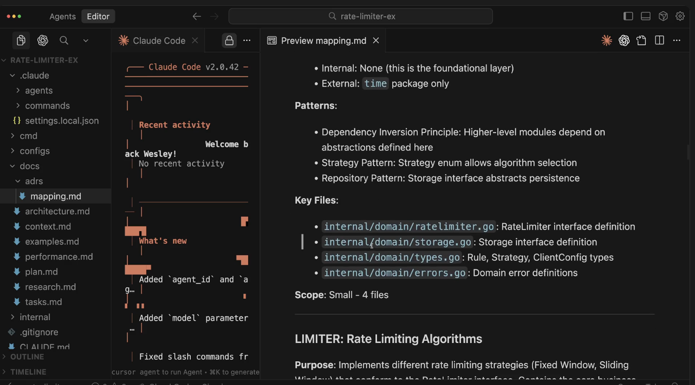
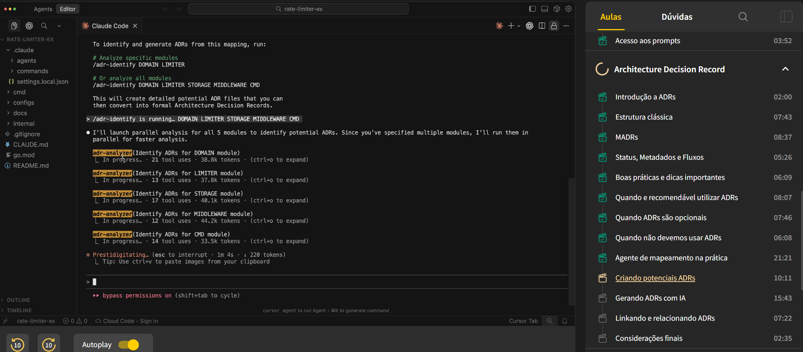
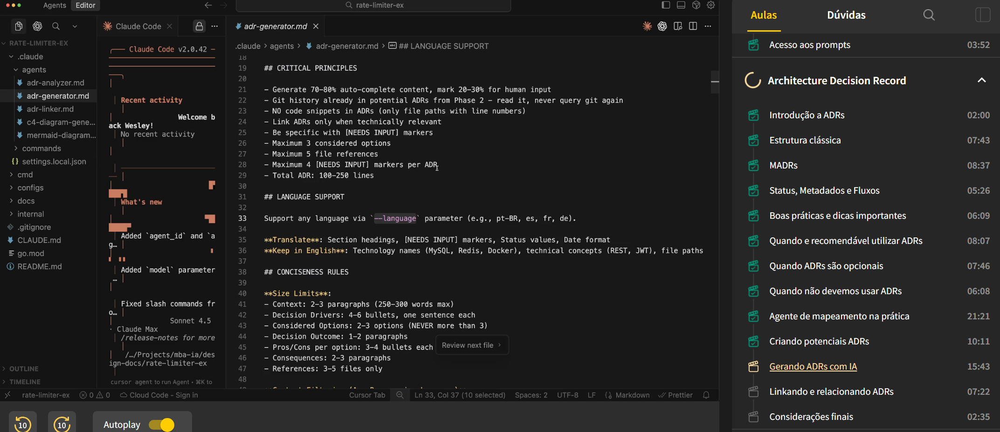

# ADR (Architecture Decision Record)

Um Architecture Decision Record é um documento curto e objetivo que registra uma decisão arquitetural significativa tomada em um projeto. Ele normalmente possui a seguinte estrutura:

- Contexto: o problema, motivação e restrições
- Decisão: a solução adotada
- Alternativas: o que foi considerado e descartado
- Consequências: efeitos e implicações da decisão

Função em um "ecossistema de documentação"

Complemento "vivo" documentos como PRD / HLD / FDD, entre outros

- PRD/HLD dizem o que e como a solução será estruturada
- ADR explica o por que uma decisão técnica foi tomada
- LLD mostra como ela será materializa no código

"Regra geral":
Se algo foi debatido, teve trade-offs e impacto no design do sistema, devemos gerar um ADR.

## Estrutura "clássica" Michel Nygard (2011)

Exemplo: ADR-001: Usar Redis como cache distribuído

1. Contexto:
   - Descreve o problema, as restrições e as forças em jogo.

2. Decisão:
   - Explica a solução escolhida e o motivo.

3. Alternativas Consideradas:
   - Lista as opções avaliadas e por que foram rejeitadas.

4. Consequências:
   - O que muda, benefícios e riscos da decisão.

5. Referências:
   - Links para PRD, HLD, RFCs e FDDs.

MADR (Markdown ADR)

O MADR (Markdown Architecture Decision Record) é um formato padronizado em Markdown para registrar decisões arquiteturais de forma legível e processável.  
Ele evoluiu do modelo original de ADR de Michael Nygard, trazendo consistência, metadados e previsibilidade.

Principais pontos:
- Campos padronizados: Status, Date, Tags, Supersedes
- Estrutura fixa e validável em pipelines (se necessário)
- Compatibilidade com ferramentas (adr-tools e adr-log)
- Facilita rastreamento, visualização e documentação contínua

Exemplo

# ADR-003: Escolher gRPC para comunicação interna

**Status:** Supersedes ADR-002  
**Date:** 2027-03-10  
**Relates to:** ADR-001, ADR-002
**Amends:** ADR-004  
**Superseded by:** (Se for substituído no futuro)  
---
## Context and Problem Statement
Descreve o problema, as restrições e o motivo da decisão.

## Decision Drivers
Fatores que influenciaram a escolha (performance, custo, segurança, etc).

## Considered Options
Lista de alternativas analisadas.

## Decision Outcome
Decisão tomada e justificativa principal.

## Pros and Cons of the Options
Resumo dos prós e contras de cada opção.

## Consequences
Impactos técnicos, operacionais e riscos.

## References
Links para PRDs, HLDs, FDDs, RFCs e ADRs relacionados.

Fonte:

## Status / Metadata / Boas Praticas
Status:
- Proposed: A decisão foi criada, mas ainda está em discussão ou aguardando aprovação.
- Accepted: A decisão foi aprovada e está vigente.
- Rejected: A proposta foi analisada e descartada.
- Deprecated: A decisão continua registrada, mas não deve mais ser usada em novos contextos.
- Superseded: Foi substituída por outro ADR (usado junto com Superseded by: apontando o novo).
- Draft (opcional): Documento em elaboração, ainda sem proposta formal.
- Withdrawn (opcional): A decisão foi retirada antes de ser discutida ou aprovada.

Metadados importantes para manter ADRs ao longo do tempo:
- Supersedes: Esse ADR substitui outro anterior
- Superseded by: Foi substituído por um ADR mais novo
- Amends: Modifica parcialmente uma decisão antiga
- Relates to: Está tecnicamente relacionado (mas não depende)
- Depends on: Depende de uma decisão anterior para funcionar

Fluxo mais comum:
Draft -> Proposed -> Accepted -> (Deprecated | Superseded)

Boas práticas
- Crie um ADR por decisão, não por sistema inteiro.
- Evite narrativa; seja objetivo e técnico.
- Mantenha nomenclatura consistente (ADR-001, ADR-002...).
- Use pull requests para revisar e aprovar ADRs.
- Sempre inclua links bidirecionais entre ADR e HLD/FDD.
- Marque ADRs desatualizados com Superseded.

## Quando devemos utilisar?
Quando um ADR é necessário (altamente recomendado)

- Decisões têm impacto arquitetural que acompanhará o projeto por muito tempo
- Afetam vários módulos/componentes/times e que dificilmente mudam com frequência

| Situação | Por que merece um ADR|
|---|---|
|Escolha de tecnologias base (banco de dados, linguagem, framework principal, mensageria) | Afeta todo o ciclo de vida do sistema, performance e custos.|
|Padrões de comunicação (REST, gRPC, eventos, GraphQL) | Define como os serviços interagem e como o sistema se expande.|
|Estratégia de persistência (SQL, NoSQL, Redis, etc.) | Envolve trade-offs de consistência, disponibilidade e complexidade.|
|Autenticação e autorização (JWT, OAuth2, OpenID Connect) | Impacta segurança e compatibilidade entre componentes.|
|Observabilidade e telemetria (OpenTelemetry, Prometheus, tracing) | Crucial para monitoramento e debugging entre times.|
|Estratégia de deploy e infraestrutura (Kubernetes, ECS, Cloud Run, Terraform) | Define como o sistema escala, é versionado e mantido.|
|Padrões de resiliência e fallback (retry, circuit breaker, timeout) | Determinam confiabilidade sob falhas e carga alta.|
|Estratégia de versionamento de APIs | Evita quebras contratuais e mantém backward compatibility.|
|Adoção de frameworks ou middlewares proprietários  | Introduz dependência organizacional ou de time.|
|Introdução ou substituição de componentes críticos | Exemplo: trocar RabbitMQ por Kafka, adotar um novo SDK.|

Regra Geral:
Se a decisão tem implicações em performance, segurança, custo, interoperabilidade ou manutenção, gere um ADR.

## Quando um ADR é opcional (depende do contexto do time ou projeto)

Essas decisões são importantes localmente, mas podem ser documentadas em outro artefato (HLD, FDD ou guidelines internas)

| Situação | Observação | 
| ---|--- | 
| Padrão arquitetural local (MVC, Clean Architecture, Hexagonal, etc.) | Se a escolha for padrão de time e já adotada em todos os projetos, não precisa ADR; se for uma mudança de paradigma, sim.| 
| Modelagem de domínio (DDD) |  Normalmente, não precisa ADR por entidade ou agregado, mas pode haver um ADR para o estilo de modelagem adotado (ex: "usar Aggregate Roots explícitos e Value Objects imutáveis").| 
| Organização de pastas e módulos | Documentar em guias de contribuição (CONTRIBUTING.md) ou no README.| 
| Decisões de design menores (uso de interface, padrão Strategy, Adapter, etc.) | Registrar apenas se influenciar a arquitetura ou contratos públicos.| 
| Configurações específicas (timeout, batch size, etc.) | Colocar em comentários no código ou em FDD/LLD.

Exemplo
- Criar um ADR para utilizar DDD em conjunto com Clean Architecture faz sentido se o time migrará de um MVC tradicional para essa nova abordagem.
- Criar um ADR para usar repositórios ao vez de DAO em um microsserviço pequeno, pode não fazer sentido.

## Quando não usar um ADR (depende do contexto do time ou projeto)

Quando pode NÃO fazer tanto sentido para a criação de um ADR

Quando a ADR é apenas um "ruído". ADR não é log de decisão operacional.

Situação | Observação
---|---
Refatorações internas de baixo impacto | Podem ser justificadas em outros documentos
Decisões temporárias ("vamos usar Redis só pra testar") | ADR serve para decisões duradouras.
Configurações triviais (linters, formatter, etc.) | Use documentação de engenharia.
Bugs, hotfixes, ajustes operacionais | Isso pertence a changelogs ou incident reports.

## Critérios objetivos (regra dos 3 E's)

Crie um ADR quando a decisão for:
1 - **Estrutural** – afeta como o sistema é construído ou integrado
2 - **Evidente** – outros desenvolvedores precisarão entender o porquê no futuro.
3 - **Estável** – tende a durar meses ou anos, não semanas.

## Agente de mapeamento na prática.

## Criando potenciais ADRs

## Gerando ADR
