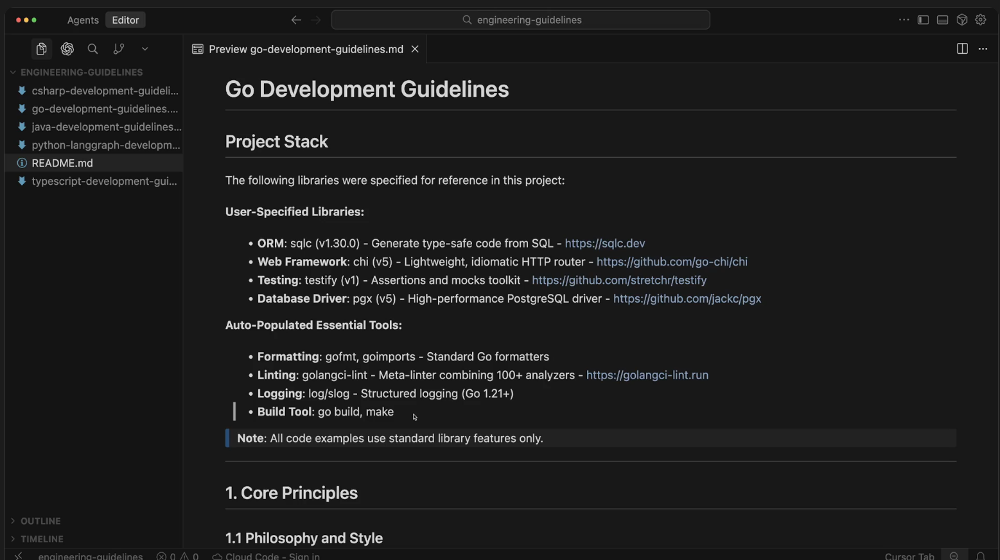
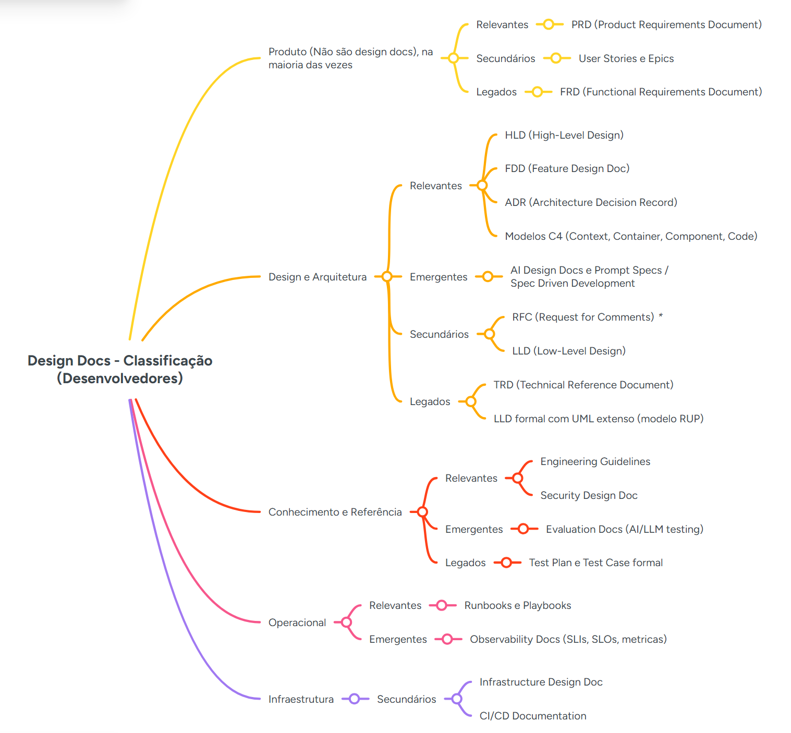

# Software Development Guidelines

O que são?

As Software Development Guidelines são um conjunto de regras e boas práticas que orientam como escrevemos, organizamos e evoluímos código dentro de um time / empresa.

Elas não definem apenas estilo, mas sim "como desenvolvemos software aqui".

## Importância ecossistema de documentação

- Facilita onboarding automático pela IA
- Reduz divergência e mantém consistência
- Acelera o desenvolvimento com estruturas prontas
- Diminui erros e retrabalho gerado pela IA
- Reduz ruído em revisões e PRs
- Permite agentes especializados trabalhando em paralelo
- Aumenta a eficácia do code review automático
- Maximiza a previsibilidade em ambientes multimodais (agentes especializados entendem as mesmas regras)

## Normalmente incluem
- Convenções de código
- Estrutura de projeto
- Padrões arquiteturais
- Boas práticas de segurança
- Formatos de testes
- Convenções de Git e PR
- Políticas de performance e observabilidade

## Exemplos de itens que compõem um Doc de Guidelines
- Core Principles
- Project Initialization
- Project Structure
- Container Development (Docker)
- Naming Conventions
- Types and Type System
- Functions and Methods
- Error Handling
- Concurrency and Parallelism
- Interfaces and Abstractions
- Unit Tests
- Mocks and Testability
- Integration Tests
- Load and Stress Tests
- Profiling and Diagnostics
- Benchmarks
- Optimization
- Security
- Code Patterns
- Dependency Management
- Comments and Documentation
- Database
- Logs and Observability
- Golden Rules
- Pre-Commit Checklist
- References

## Project Stack

## Exemplo de documento
https://devfullcycle.notion.site/Exemplo-de-Software-Development-Guidelines-2bb1423c03888011a123cc1efc9041f5

## Prompt para gerar o guideline
07-Design Docs with IA\sourcecode\fc-claude-mkt-place\plugins\development-guidelines\commands\guidelines-generate.md

## Mindmap
https://www.mindmeister.com/app/map/3863580263?t=7cHe2Hud6K

## Classificação geral
https://devfullcycle.notion.site/Classifica-o-geral-de-documentos-2a11423c03888054bbd6d13301d827ba