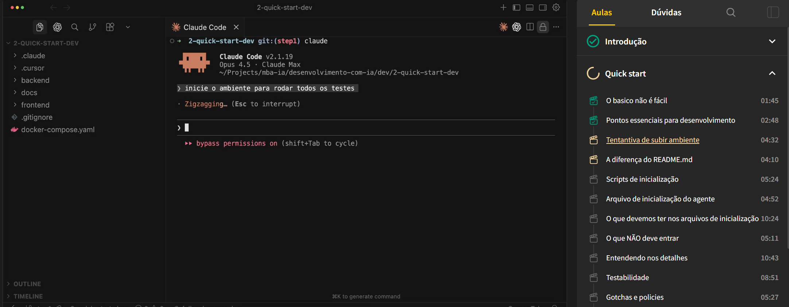
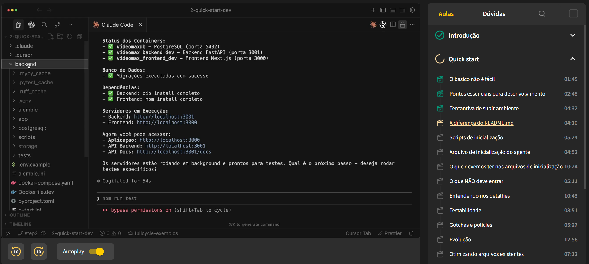
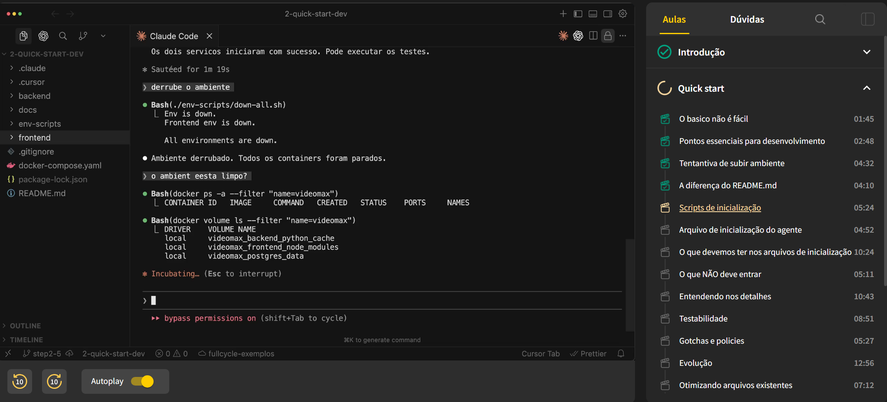
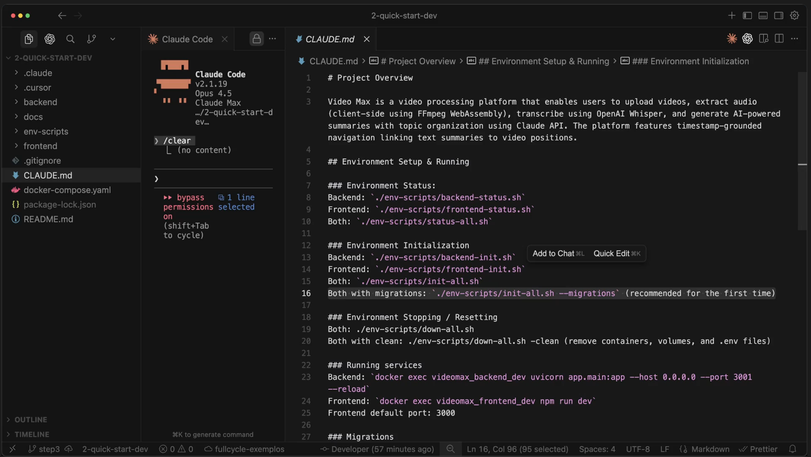
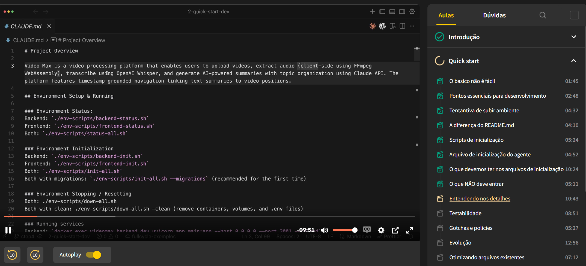
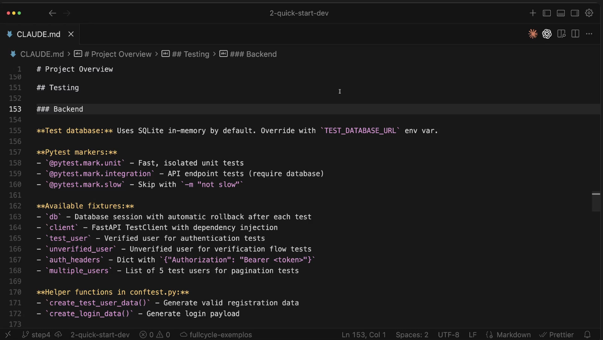
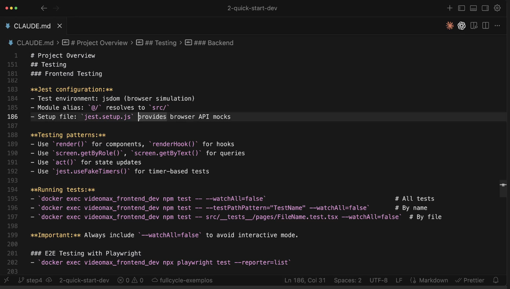
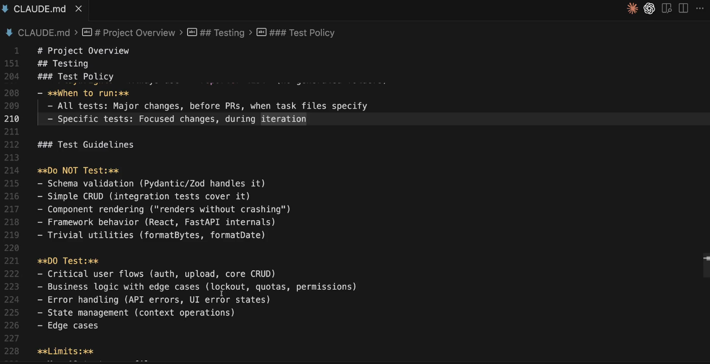
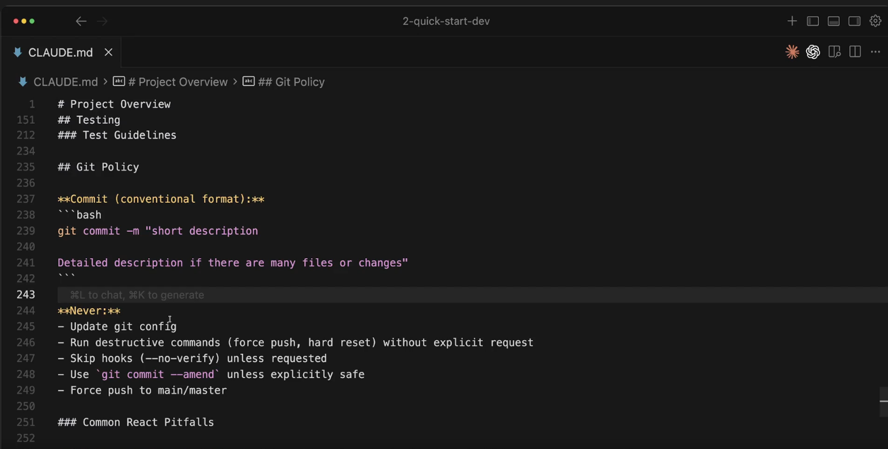
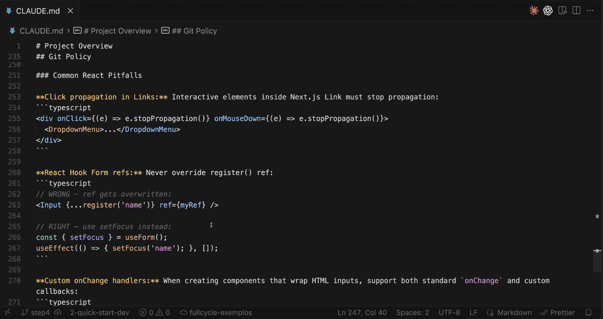

# Quick start

## Pontos essenciais (Não subestime!):
O Agente precisa:
- Saber instalar o ambiente de desenvolvimento pela primeira vez (from scratch)
- Reconhecer se o ambiente já está em funcionamento
- Resetar / desinstalar o ambiente

## Etapas básicas para desenvolvimento de QUALQUER aplicação

1) Inicialização
- O Agente tem de ser capaz de iniciar o ambiente da forma mais simples possível, sem ter que ficar explorando o tempo todo sua base de código todas as vezes.

2) State
- O Agente precisa entender o estado atual do sistema de forma extremamente simples e rápida

3) Desenvolvimento
- O Agente precisa ter clareza do que e como ele vai desenvolver (não basta apenas um bom prompt)
- Precisa aprender ao longo do tempo para ficar mais preciso
- Saber por onde começar ou resumir um trabalho em andamento

4) Testabilidade e feedback
- O Agente precisa ter mecanismos para validar seu próprio trabalho
- Precisamos ter um fluxo / rotina clara com o time de melhorar esses mecanismos diariamente


## Tentativa de subir o ambiente
Aplicancão não conseguiu subir.


## Importancia do Readme
Aplicação subiu.


## Script de inicialização



## Arquivo de inicialização do Agente




## O que devemos ter nos arquivos de inicialização

# Quick start

## Pontos essenciais (Não Subestime!)
O Agente precisa:
- Saber instalar o ambiente de desenvolvimento pela primeira vez (from scratch)
- Reconhecer se o ambiente já está em funcionamento
- Resetar / Desinstalar o ambiente

## Etapas básicas para desenvolvimento de QUALQUER aplicação

### 1) Inicialização
O Agente tem de ser capaz de iniciar o ambiente da forma mais simples possível, sem ter que ficar explorando o tempo todo sua base de código todas as vezes.

### 2) State
- O Agente precisa entender o estado atual do sistema de forma extremamente simples e rápida

### 3) Desenvolvimento
- O Agente precisa ter clareza do que é e como ele vai desenvolver (não basta apenas um bom prompt)
- Precisa aprender ao longo do tempo para ficar mais preciso
- Saber por onde começar ou resumir um trabalho em andamento

### 4) Testabilidade e feedback
- Agente precisa ter mecanismos para validar seu próprio trabalho
- Precisamos ter um fluxo / rotina clara com o time de melhorar esses mecanismos diariamente

## O que deve ter em um arquivo de inicialização para o agente (CLAUDE.md, AGENTS.md)

### 1) Contexto do projeto
Em uma única linha que oriente o Agente imediatamente sobre tecnologias e propósito.

**Exemplo:**  
"API REST com FastAPI para autenticação de usuários, usando SQLAlchemy para banco de dados e Pydantic para validação."

### 2) Comandos frequentes

Evitam que o Agente adivinhe ou alucine flags inexistentes. Documente comandos de build, teste e lint com seus parâmetros exatos:

**Running tests:**

```bash
docker exec videomax_backend_dev pytest                       # All tests
docker exec videomax_backend_dev pytest -v -k "test_name"   # Specific test
docker exec videomax_backend_dev pytest tests/unit/          # Unit tests only
docker exec videomax_backend_dev pytest tests/integration/   # Integration tests only
```

### 3) Guias de estilo específicos

Em vez de "formate o código corretamente"...

Especificar: Use ES modules (import/export), TypeScript strict mode, indentação de 2 espaços sem tipos any.

### 4) Diretórios-chave do projeto

Ajudam o agente a navegar de forma mais eficiente, especialmente em monorepos; Ex:

- ...
- ...
- ...

### 5) Orientações / Workflow

- Abertura de PRs
- Code review
- Use de branches
- Limites de escopo
- Verificação manual necessária *

### 6) Observações sobre o ambiente

- Problemas comuns
- Regras peculiares de infra, variáveis de ambiente obrigatórias

### 7) Regras que se aplicam para todos os devs da empresa

- Nunca faça um push na main
- Revise a descrição do commit antes de enviar
- Não crie testes de unidade que já estão cobertos pelos de integração

### 8) Importação de arquivos

- Adicione outros arquivos com @path, podendo dividir o CLAUDE/AGENTS.md em seções menores;

ex:
- @docs/code-styles.md - Code Style do Projeto


## O que **NÃO** deve ter em um arquivo para o agente

- **Informações que o Agente consegue deduzir**
  - Nomes de arquivos, funções, classes
  - Documentação extensa de APIs ou libs
  - O que muda constantemente
  - Conteúdo muito longo ou autoexplicativo  
    *(não escreva código com problema de segurança)*

---

## Como evoluir o arquivo ao longo do projeto

- Comece pequeno: inclua apenas regras essenciais  
  *(Use um `/init` apenas para esqueleto)*
- Revise **MUITO** de forma periódica junto com o time  
  *(Faça code-reviews, testes, etc.)*
- Crie seções por temas. Se ficar muito longo, mova para arquivos separados.
- Marque, grife, crie títulos fortes para itens críticos  
  *(ex: **IMPORTANTE**)*
- Sincronize com a Skill  
  *(Sempre que adicionar uma nova Skill, verifique se alguma instrução não deve ser movida — e vice-versa)*

---

## Regra geral

**O que deve ser carregado sempre fica no `CLAUDE.md`, `Agents.md`, `GEMINI.md`, etc.**


## Entendendo nos detalhes


## Testabilidade




## Gotchas e Policies



## Evolução
### Como evoluir o arquivo ao longo do projeto

- Comece pequeno: inclua apenas regras essenciais.  
  *(Use um `/init` apenas para esqueleto)*
- Revise **MUITO** de forma periódica junto com o time  
  *(Faça code-reviews, testes, etc.)*
- Crie seções por temas. Se ficar muito longo, mova para arquivos separados.
- Marque, grife, crie títulos fortes para itens críticos  
  *(ex: IMPORTANTES)*
- Sincronize com a Skill  
  *(Sempre que adicionar uma nova Skill, verifique se alguma instrução não deve ser movida — e vice-versa)*

---

### Regra geral

**Verifique se tem as "Etapas básicas para desenvolvimento de QUALQUER aplicação"**
**O que deve ser carregado sempre fica no `CLAUDE.md`, `Agents.md`, `GEMINI.md`, etc.**


## Otimização de arquivos existentes

## Já tenho o arquivo de inicialização, como melhorar o atual?

- Detecte conflitos (decisões que se contradizem)
- Extraia somente os aspectos mais importantes
- Separe todo o restante em arquivos baseados na necessidade de serem carregados pelo agente
- Referencie esses arquivos, dando exemplos de quando o agente deve chamar  
  *(Isso não é uma Skill)*
- Faça com que conceitos extremamente vagos tornem-se regras  
  *(provoque o agente)*
- Gere/atualize o arquivo e faça a geração dos novos

---

## Prompt exemplo

Restructure my `CLAUDE.md` into a layered system: a lean root file with universal rules, and dedicated files for context-specific guidance that the agent reads only when relevant.

### Steps

1. **Detect conflicts**  
   Scan for instructions that contradict each other. When you find one, show me both versions and ask which to keep.

2. **Extract the universal core**  
   The root `CLAUDE.md` should contain only:
   - Project summary (one paragraph)
   - Tech stack: language, framework, runtime
   - Environment: how to start, how to verify it's running, how to stop
   - Folder structure: main directories and their purpose, 2–3 levels deep for stable paths
   - Build tooling: package manager, build/lint/typecheck commands (only if non‑standard)
   - Test commands: how to run all tests, a single test file, or a specific test
   - Rules that apply regardless of what task is being performed

3. **Split by task type**  
   Move everything else into separate files based on when the agent would need them:
   - Code style and naming
   - How to write and organize tests
   - API and endpoint design
   - Commit messages and branching
   - Project structure and file placement

4. **Link with triggers**  
   In the root file, tell the agent when to check each file.  
   Example: *“When adding a new route, first read `.claude/api-patterns.md`”*

5. **Make vague rules concrete**  
   For any instruction that sounds abstract, rewrite it to include:
   - The specific action to take
   - A brief example if it helps
   - Why it matters (when non‑obvious)

6. **Challenge each instruction**  
   For every rule, ask:
   - "Would the agent behave differently without this?"
   - Collect the ones that fail this test and show them to me with a one‑line reason for each.
   - Wait for my confirmation before removing any.

7. **Output the new structure**
   - Rewritten root `CLAUDE.md` (minimal, with pointers to other files)
   - Each specialized file with its instructions
   - Recommended folder layout (e.g., `docs/guidelines/`)


## Dica final
**Se ao desenvolver uma tarefa dificil o agente teve muita dificuldade de acertar no desenvolvimento de algo, faça um prompt pedindo para ele adicionar uma instrução no agent.md para que ele não erre mais.**
Ex: 
Prompt: Porque essa tarefa foi dificil?
R:....
Prompt: Adicione no arquivo agent.md

