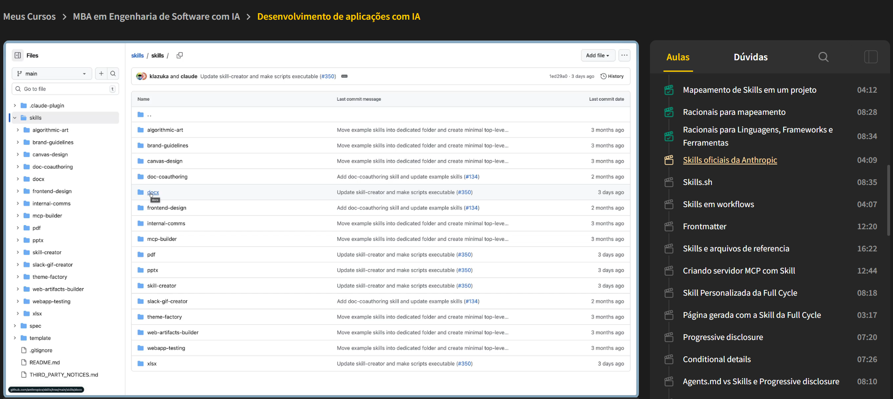
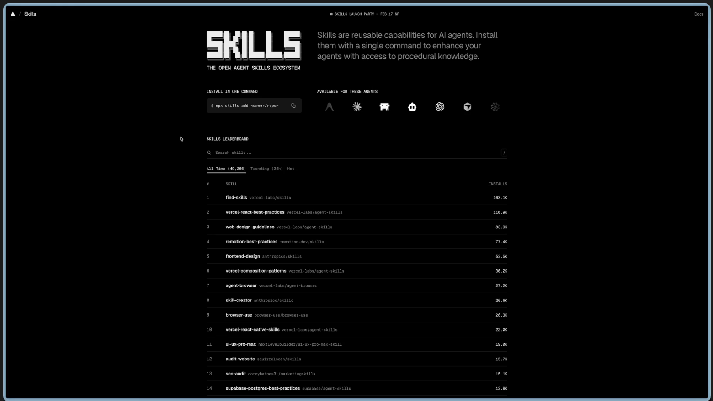
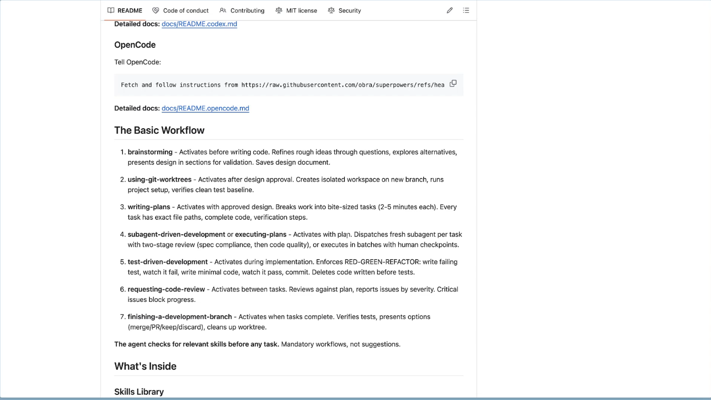
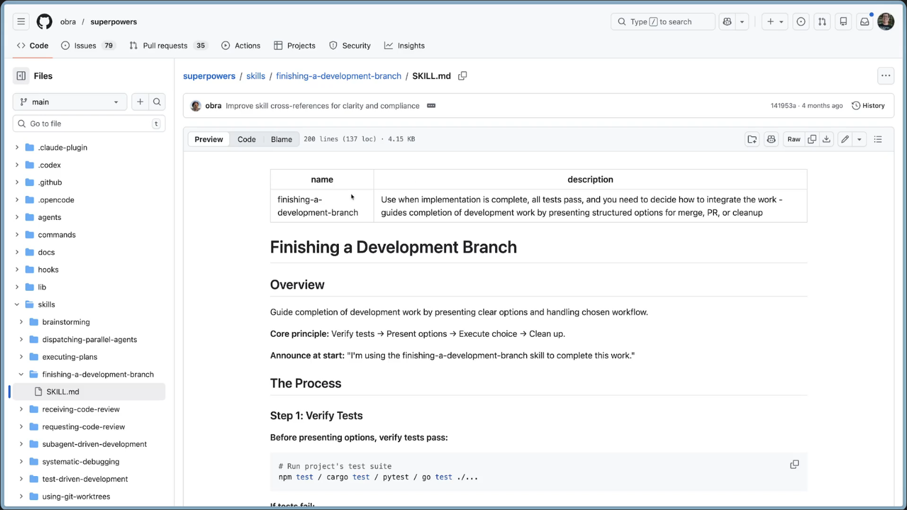
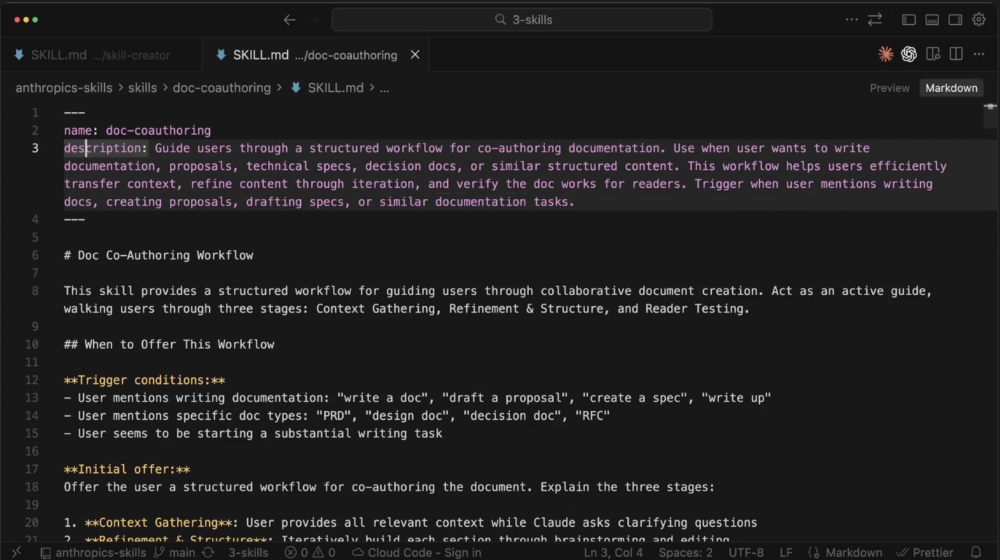
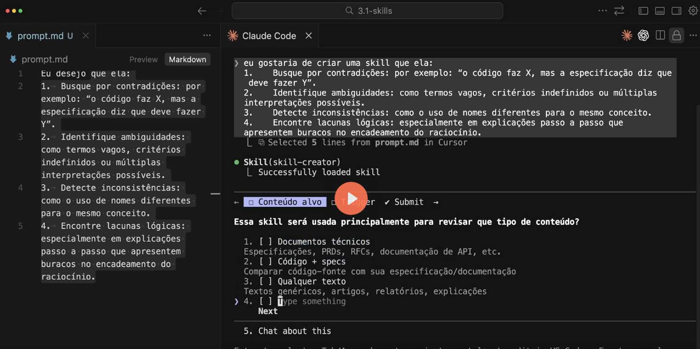
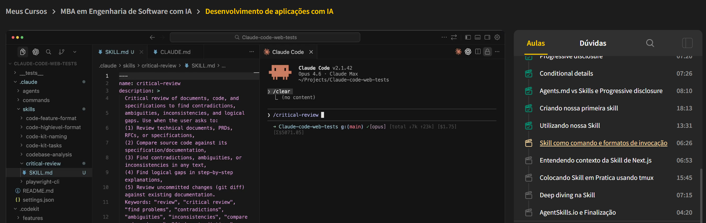
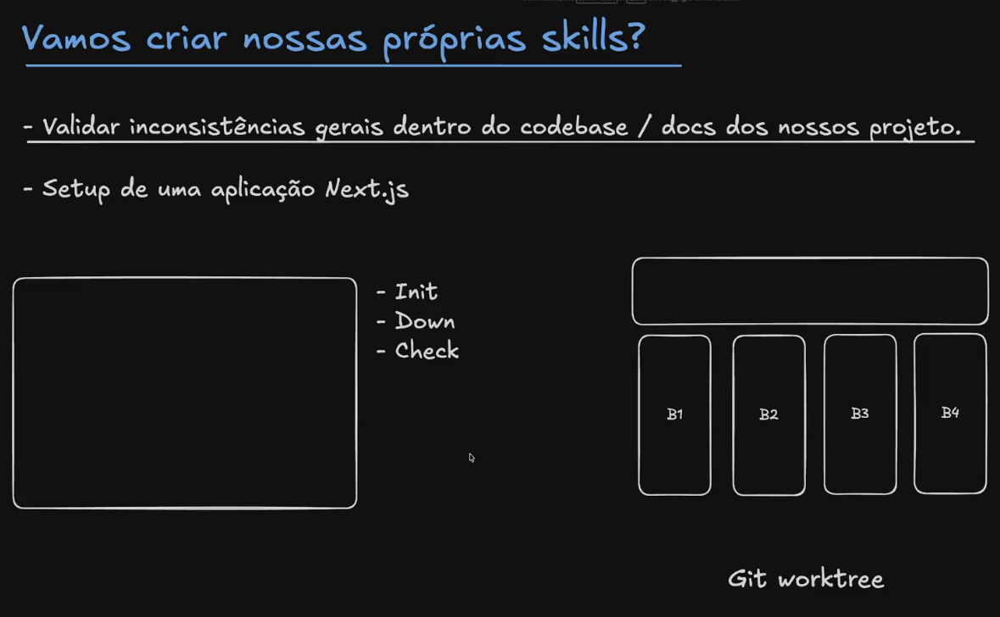

# Project Skills

## O que são Skills

- Habilidades que poderão ser informadas ao Agente para resolver tarefas de domínios específicos
- Skills normalmente são carregadas *on‑demand*, ou seja, o Agente carrega a skill somente quando tem a necessidade de executar alguma tarefa correlata à skill
- Em alguns softwares de codificação, como Claude Code, uma Skill também pode ser executada como um “slash command”, ex: `/nome-da-skill`, ou mesmo ser pré‑carregada em um subagente em seu *frontmatter*

---

## Mapeamento de Skills de acordo com o projeto

- Entenda profundamente o projeto e determine quais Skills fazem sentido serem utilizadas
- Leia com atenção a descrição do *frontmatter* da skill, pois será exatamente baseado nessa descrição que o agente decidirá utilizá‑la ou não

---

## Racional para mapeamento

- Backend vs Frontend / Full Stack ou Mobile
- Habilidades amplas / conceituais:  
  Ex: `frontend-design`

- Guidelines:  
  Ex: `web-design-guidelines`

- Language oriented:  
  Ex: `python-performance-optimization`, `typescript-advanced-types`

- Framework oriented:  
  Ex: `vercel-react-best-practices`, `java-spring-boot`

- Tools oriented:  
  Ex: `github-actions-templates`, `agent-browser`, `playwrite`

  **Se o LLM está fazendo fetch para executar alguma ação, significa que existe uma oportunidade de criar uma skill**


## Anthropic Skills


## Skills.sh



## Skills em workflows (Repo: Obra SuperPowers)




## Frontmatter (Skill trigger)




## Skills e arquivos de referencia
Skills.MD < 500 linhas
Use referencias


# Progressive Disclosure Patterns

**Carregamento on-demand:** Mesmo quando a skill é invocada, ainda assim ela verifica se há necessidade de continuar se aprofundando no conteúdo e arquivos auxiliares.

**High-level guide com referências**

- fullycycle-design-system  
  > assets  
  > references  
    - components.md  
    - page-variations.md  
    - pages.md  
    - SKILL.md  

## Page Layouts
For detailed page specs, see: [references/pages.md](references/pages.md)  
For special states/modals, see: [references/page-variations.md](references/page-variations.md)

**Carregamento apenas quando necessário.**

# Domain-specific organization

- fullycycle-domain-rules  
  > reference  
    - billing.md  
    - certificates.md  
    - crm.md  
    - sales.md  
    - SKILL.md  

## Full Cycle Development by Domain Rules

## Available Business Rules and Technical Rules

### Billing
Payment processing, billing, invoices, gateway integration, payment methods → see: [reference/billing.md](reference/billing.md)

### CRM
Hubspot integration, lead scoring, contact management, sales pipeline → see: [reference/crm.md](reference/crm.md)

### Student Certificates
Certificate generation, certificate templates, certificate authenticity → see: [reference/certificates.md](reference/certificates.md)

### Sales
Sales pipeline, sales tracking, sales opportunities, sales quotes, sales orders → see: [reference/sales.md](reference/sales.md)

## Quick search
```bash
grep -i "billing" reference/billing.md
grep -i "crm" reference/crm.md
grep -i "certificates" reference/certificates.md
grep -i "sales" reference/sales.md
```

## Conditional Details

## Mode 4: Codebase Maturity Classification

Assess codebase maturity to inform complexity adjustments.

| Maturity      | Indicators                                                   | Modifier  |
|---------------|--------------------------------------------------------------|-----------|
| `greenfield`  | No source files, empty project, only config/scaffolding      | -1 level  |
| `emerging`    | <10 components, <5 integrations, nascent patterns            | No change |
| `established` | 10–50 components, clear patterns, moderate coupling          | No change |
| `mature`      | 50+ components OR avg coupling ≥10, many integration points  | +1 level  |

### Detection Criteria

Extract from codebase-exploration.md or architectural analysis:

1. **Component Count**: From Critical Components Analysis table  
2. **Average Coupling**: Mean of (afferent + efferent) coupling values  
3. **Integration Count**: Rows in Integration Points table  

### Classification Logic
IF no source code sections OR component_count = 0: maturity = greenfield 
ELSE IF component_count < 10 AND integration_count < 5: maturity = emerging 
ELSE IF component_count <= 50 AND avg_coupling < 10: maturity = established 
ELSE: maturity = mature
Output: `greenfield`, `emerging`, `established`, or `mature`


## Progressive disclosure: Agent.md vs Skills

### Agents.md / CLAUDE.md

Quando fazemos referência a um documento no arquivo de memória / inicialização do agente, podemos trabalhar no formato de progressive disclosure, informando referências mais aprofundadas aos arquivos, porém com diversas limitações.

- Quando utilizamos o `@<path>` no Agents.md, automaticamente ele faz a incorporação do conteúdo, ou seja, faz a leitura total dos arquivos.

- Se não mapeamos com o "@", podemos tentar instruir os agentes a coisas como:

**IMPORTANT:** Before starting any activity, understand what docs below are relevant for your task and read them first.

Isso não traz garantia de leitura, e muitas vezes faz com que o agent apenas faça um scan no arquivo parcial ("gastando uma tool call").

Porém, isso não é uma prática errada. É útil e em muitos casos isso funciona; por outro lado, é mais recomendado utilizar esses tipos de abordagens com documentos específicos do projeto. Diferente de skills que normalmente são compartilháveis e distribuíveis.

### Skills

Skills podem trabalhar com progressive disclosure, mas ao mesmo tempo elas são desenhadas para:

- Começar com pouco contexto  
- Decidir o que precisa ler  
- Buscar somente os arquivos certos  
- Parar de ler quando já tiver o suficiente  
- Possuir um fluxo consistente de como ela deve seguir  
- Ler parâmetros de entrada (similar aos comandos) — (skills atualmente podem já ser utilizadas como /commands)


## Criando skills

### Vamos criar nossas próprias skills?

- Validar inconsistências gerais dentro do codebase / docs dos nossos projeto.


- Setup de uma aplicação Next.js


## Skill as commands:



## Skill de Next.js




## Finalizando
https://github.com/anthropics/skills/tree/main/skills

https://agentskills.io/home

https://skills.sh/

https://github.com/obra/superpowers/tree/main/skills

https://github.com/microsoft/playwright-cli
