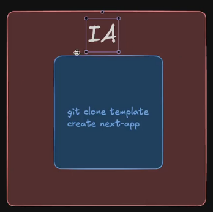
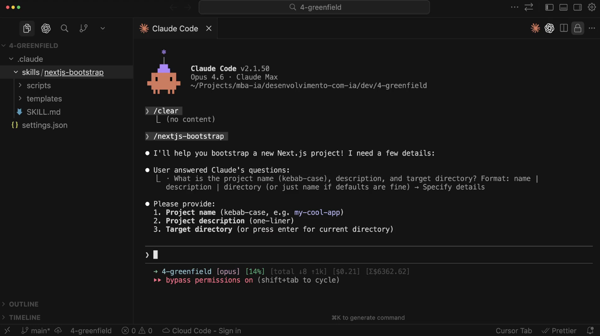
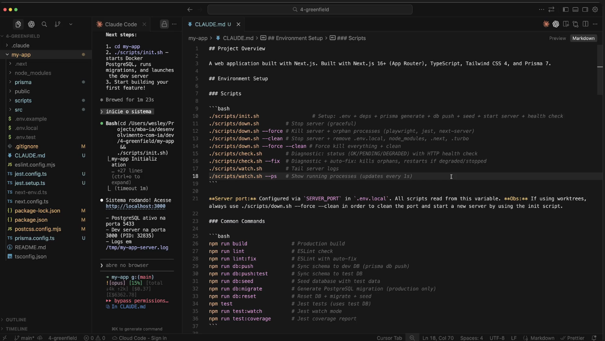

# Desenvolvimento de novas aplicações (Green Field)

## Abordagens para iniciar o projeto
- Tecnologias / Frameworks – Inicialização  
- Solicitando para a IA criar estrutura do zero  
- Skill customizada para seguir o padrão da empresa  

## Tecnologias / Frameworks – Inicialização
- Trabalhar com IA não significa que não devamos fazer tudo do absoluto zero  
- Conhecer ferramentas / frameworks é necessário e utilizar seus recursos nativos pode poupar muito tempo  
- Se o comando que você solicitar para IA for exatamente o mesmo que você irá digitar (e que você "já sabe de cabeça"), faça você mesmo.

## Skill customizada

- Opte por ter skills personalizadas para o bootstrap do seu projeto  
- Evite fazer a IA ficar gerando arquivos "manualmente"; utilize scripts de geração (esses scripts podem clonar eventualmente repositórios)  
- Ainda que clonar um repositório inicial faça muito sentido, a Skill poderá flexibilizar / personalizar a experiência no processo de geração; logo, talvez faça sentido trabalhar de forma híbrida  

## Fazendo Bootstrap do next-js

## Executando o projeto e analisando regras
