# Testes automatizados no dia Zero!

- Testes automatizados utilizando a IA de forma errada pode ser o maior ponto de falsa sensação de segurança que seu código está coberto.

- IA precisa ter clareza do que testar e como testar.

- Testes de UI devem ter um cuidado mais do que especial. Normalmente é aonde grande parte dos tokens são gastos e muitas vezes a IA entra em um loop.

- Sempre pense: Se eu der uma tarefa, e não intervir, ela será capaz de testar realmente o que foi desenvolvido (independente de quem desenvolveu?)

**Definição clara sobre o que são testes de Unidade, Integração, E2E**

# Definição clara sobre o que são testes de Unidade, Integração, E2E

## Unit Tests
→ Simples unidade (uma classe, um método, etc. sem dependências externas)  
**Perigo:** Mocks. IA pode tentar gerar muitos mocks para realizar os testes. (Tome ainda mais cuidado com Frontend)

## Integration
→ Pode haver múltiplas interpretações:
- Integração entre classes / componentes do sistema  
- Incluem banco de dados? Qual tipo? SQLite vs Postgres  
- Integração com sistemas externos  
- Integração entre frontend / backend  

## E2E
→ Pode haver múltiplas interpretações:
- Fazer uma chamada completa em uma API?  
- Fazer o teste também chamar serviços externos  
- Abrir o browser e executar uma ação que deve chamar a API  
- Verificação de UI  

**Perigo:** A falta de definição clara sobre o que cada categoria de teste representa pode gerar situações catastróficas.

## Cobertura de código

Defina claramente os parâmetros sobre o que representa X% de cobertura de código.

- IA tende a garantir literalmente a % de cobertura de código, principalmente os de unidade, em que algumas vezes jamais seriam testados individualmente por conta de relevância e que indiretamente seriam testados por testes de integração.

## Verificação / Implementação

- Busque entender se a abordagem que a IA está utilizando para gerar os testes está correta.

- Faça um planejamento (modo plan), solicitando uma análise de quais são os testes "inúteis" ou redundantes que não deveriam estar no projeto. Após a identificação, se fizer sentido, faça a remoção, e solicite ela adicionar em sua "memória" para não repetir mais esse comportamento, ou tenha uma guideline clara de como o agente deve se comportar.

- Faça um planejamento (modo plan), solicitando uma análise de testes de "edge cases" que ela não implementou. IA muitas vezes pode tender a fazer testes óbvios, porém, pode evitar a realmente pegar as situações importantes que não seguem o fluxo comum da aplicação.

No inicio do projeto pode precisar de uma arvore do projeto, depois pode remover do agent.md pois o padrão já estará estabelecido.
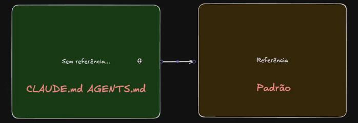

## Removendo testes desnecessários
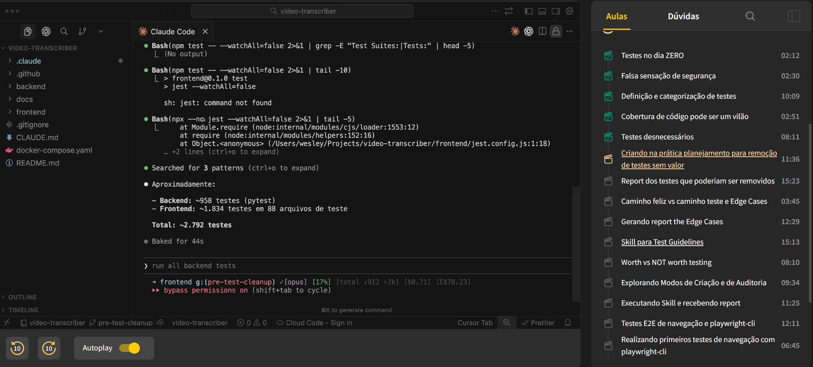

Prompt simples
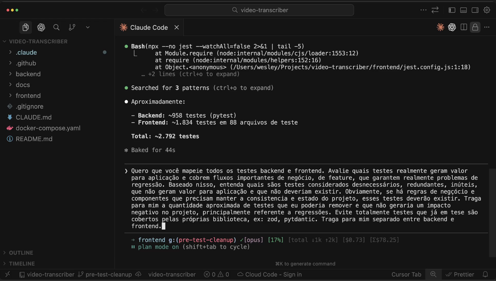

Thinking...
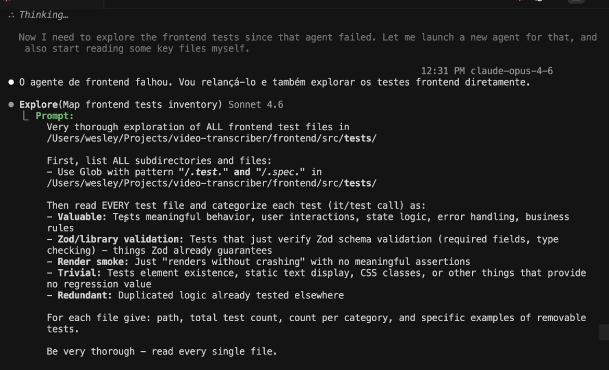

## Gerando report de Edge Cases
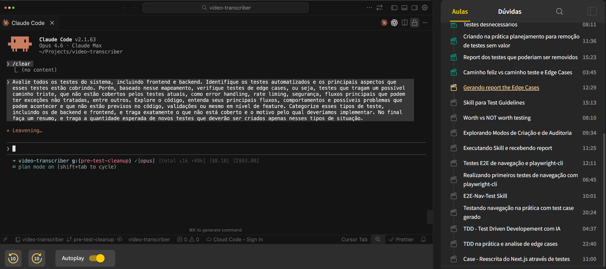

## Skills com dois modos
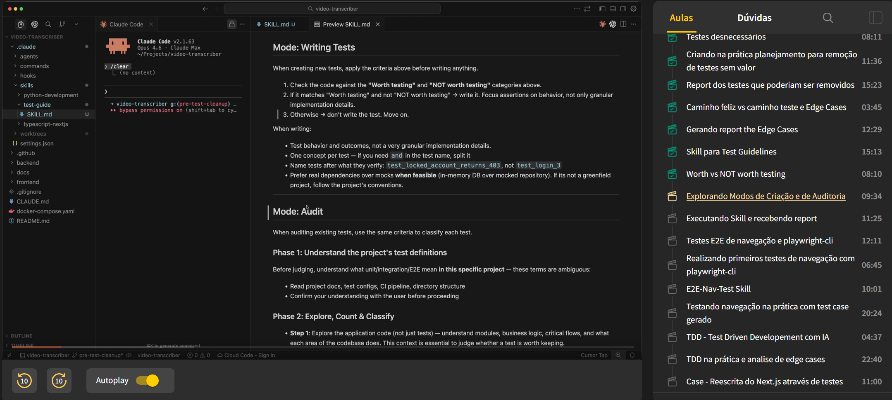

## Testes de frontend / Browser

- Quando estiver trabalhando com frontend, tenha clareza exata do que ela deverá testar, indicando exatamente quais os fluxos.

- IA tende a iniciar sempre um fluxo do zero, logo, 70% dos testes provavelmente serão executados de forma redundante. (Aproveite sessões / cookies do browser)

- Trabalhe ao máximo de forma headless

- Entenda o nível de complexidade dos testes; grande parte dos testes pode ser feita com playwright-cli + skill (mais leve) ao invés de playwright + MCP. (Sendo playwright um exemplo de ferramenta de testes)

## Testes E2E de navegação e playwrite cli com skill
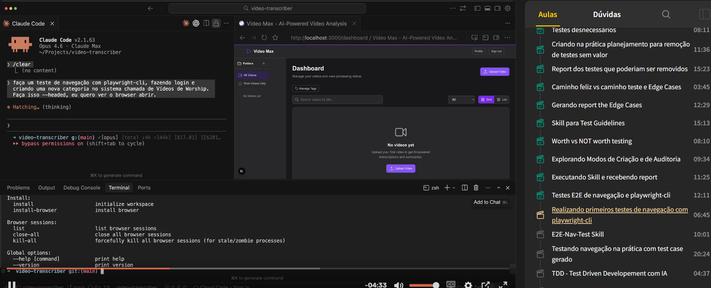

Executando skill
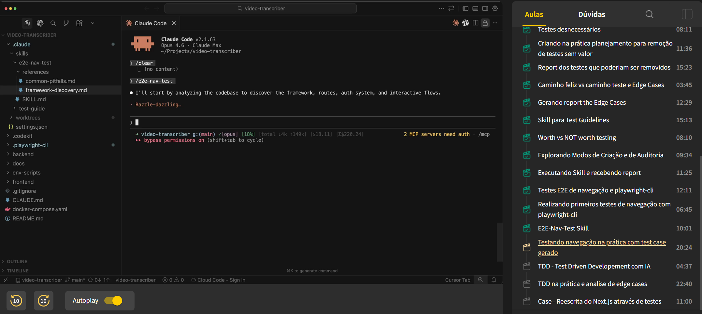

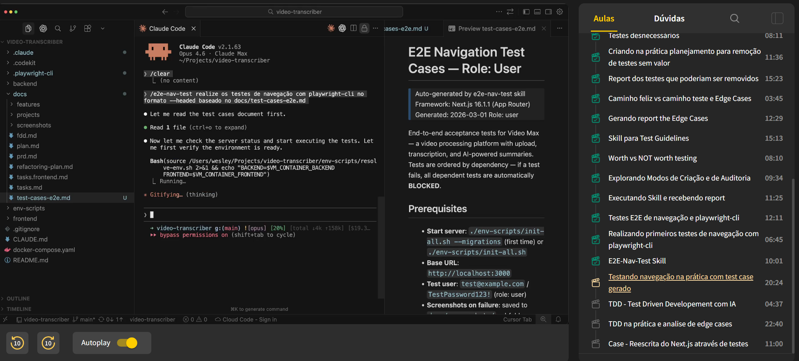

## TDD (Test Driven Development)

- TDD sempre foi uma ótima metodologia para o desenvolvimento de software e sem dúvidas pode ser uma abordagem extremamente válida para o processo de desenvolvimento com IA.

- TDD visa criar primeiramente os testes para depois a implementação e refatoração.
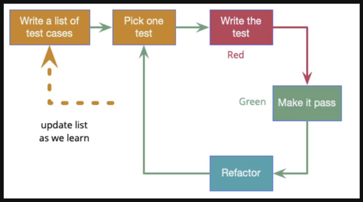

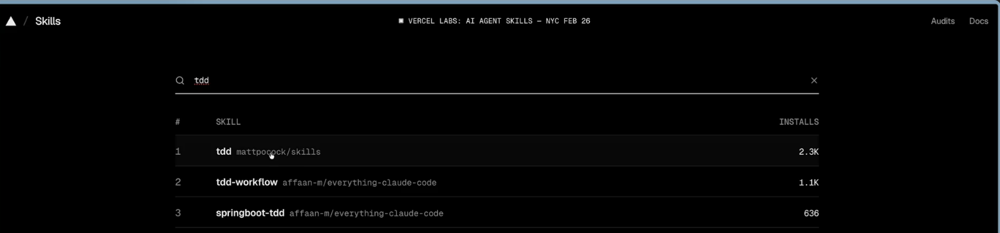

## TDD na prática
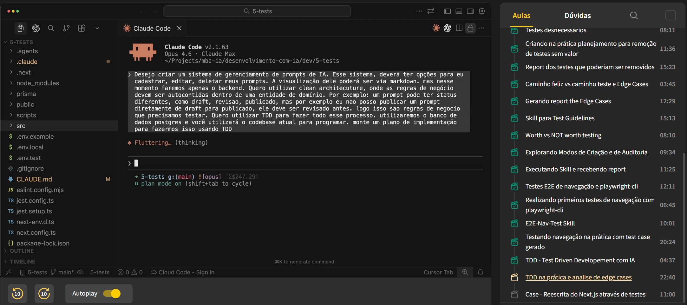

## Metodologia na reescrita do next.js
Interessante que só foi possível implementar isso porque existiam testes E2E
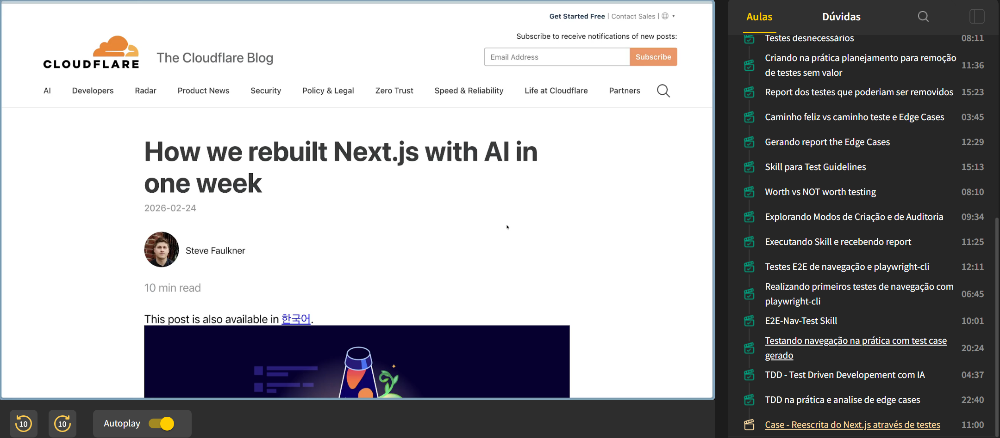