# Desenvolvimento de aplicações com IA

## Arquitetura do StreamTube
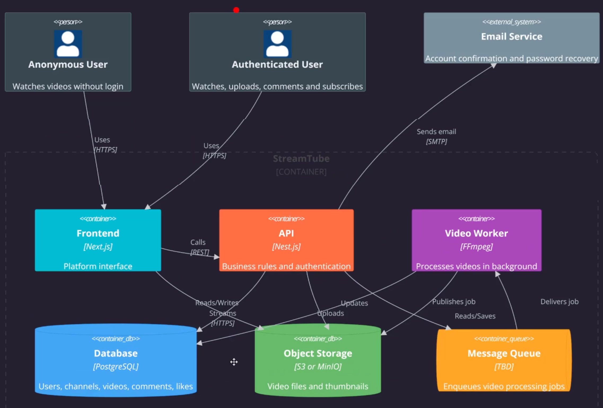

 
## Dinâmica de desenvolvimento do projeto
- Back-end (Nest.js)
- Fundação de IA para Back-end
- Front-end (Next.js)
- Fundação de IA para Front-end
- Dev Fullstack - ambos ao mesmo tempo

## Workflow de desenvolvimento com IA
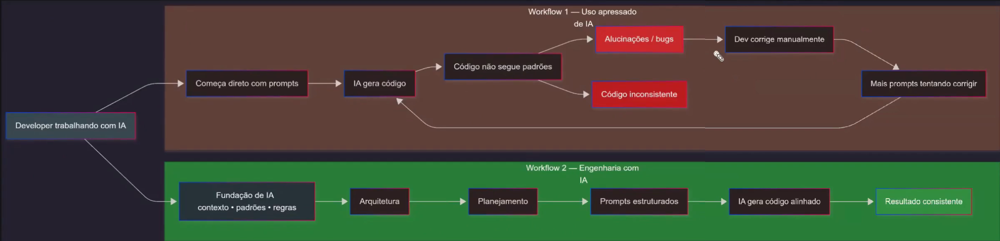

## Worflow Plan --> Implement

## Workflow com Design First

## Fundação da IA

## Artefatos de fundação com Claude Code / Copilot

## Claude Code Configurations (How artefacts helps)
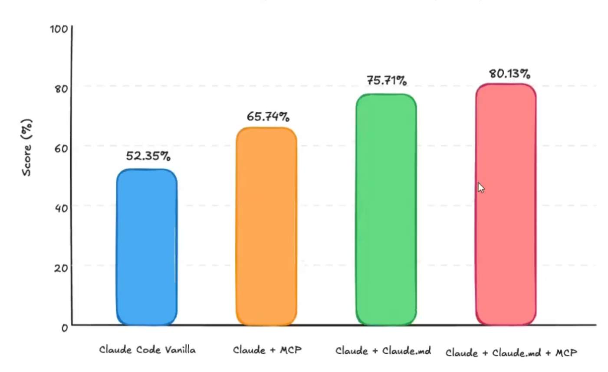

## Engenharia de contexto

## Criando Projeto backend com Nest.JS
- sudo apt update && sudo apt upgrade -y
- sudo apt autoremove -y
- Install Node with NVM https://nodejs.org/en/download
- npm install -g @nestjs/cli
- nest new nestjs-project
- npm run start:dev

## Configurando Docker no Projeto
- Criar o docker file e o compose.
- Instalar o docker desktop e linkar o docker com o wsl

## A fundação de IA que vamos implementar
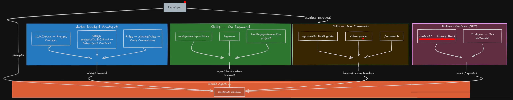

## Criando arquivo CLAUDE.md global
No video ele copia e cola o conteúdo e mostra o conteudo do arquivo. 
Regras inegociaveis

## Criando o sub CLAUDE.md do Nest.JS
No video ele copia e cola o conteúdo e mostra o conteudo do arquivo. 
Regras inegociaveis

## Criando as Rules (Code conventions)
frontmatter com paths
Ele copiou e colou tudo também...
Regras inegociaveis

## Dicas de curadoria de skills no projeto

### Avaliando a própria SKILL e de terceiros

- Li o SKILL.md e todos os arquivos auxiliares por completo?
- A description é precisa? Não vai disparar falsos positivos/negativos?
- A estrutura é modular (index leve + referências lazy)? (Para skill grandes)
- O impacto na context window é aceitável?
- Não há instruções suspeitas, prompt injection ou chamadas externas estranhas?
- Testei em cenários reais do meu projeto?
- Testei em mais de um modelo (se aplicável)?
- A skill é compatível com meu stack e convenções?
- Não conflita com outras skills ativas?
- Sei quem é o autor e se a skill é mantida?

## Curadoria da skill de boas praticas do nest.js
Ele baixou a skill nestjs-best-practice
Apagou o readme, agent.md e a pasta scripts
E alterou com o prompt:
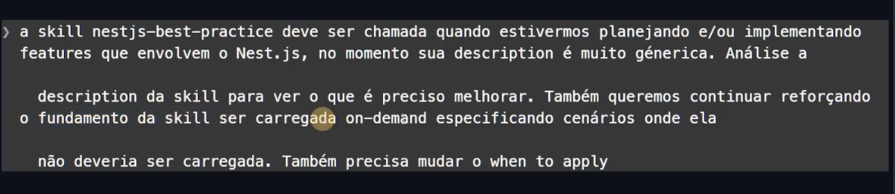

Não deu certo e ele pediu para refazer. Ele quer um frontmatter mais objetivo com menos de 100 tokens

Alterou na mão até dar 92 tokens

Teste de planejamento...
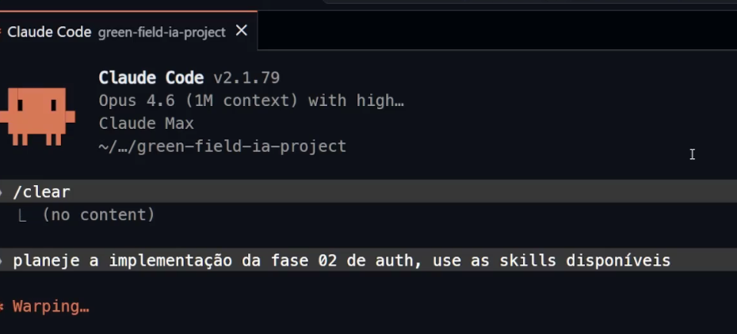

## Curadoria  da skill de vboas praticas do TypeORM
Problemas: 600 linhas e descrição ruim.

## Confrontando as Regras e as skills
Boa ideia...
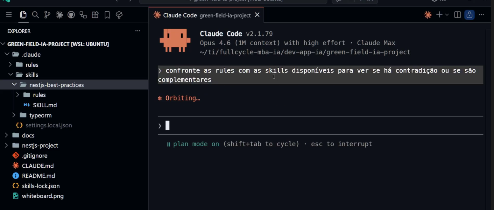

## Introdução ao MCP
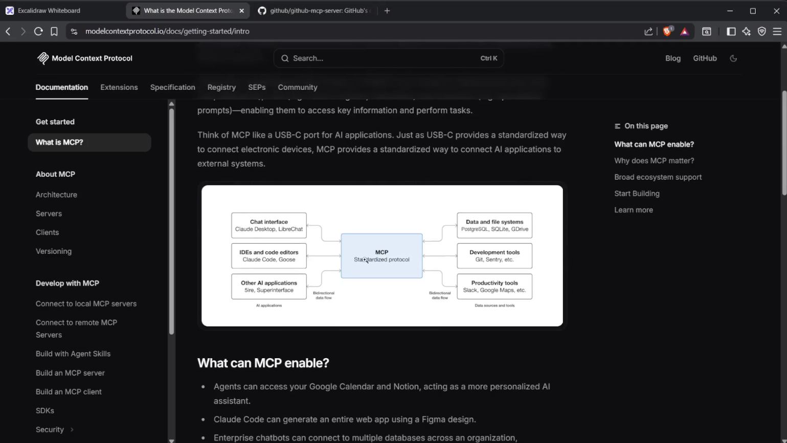

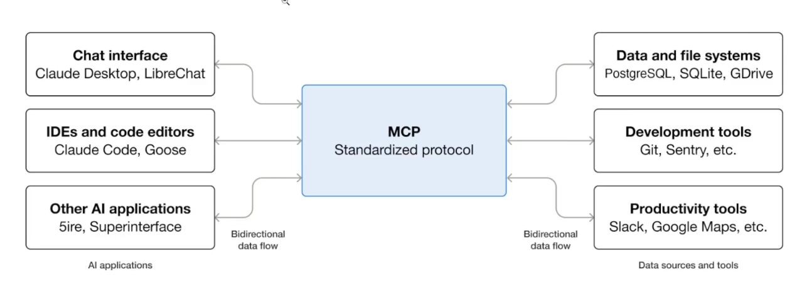

## Workflow dos servidores MCP do projeto
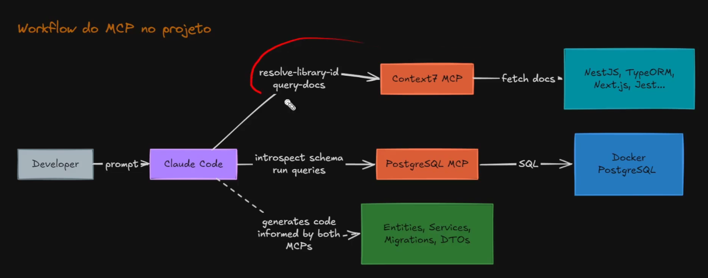

## Configurando MCP do Context7
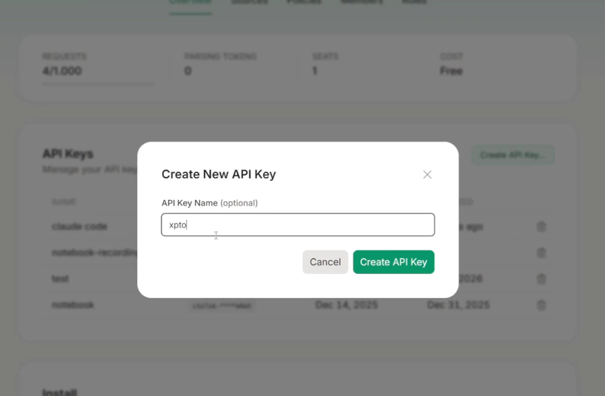

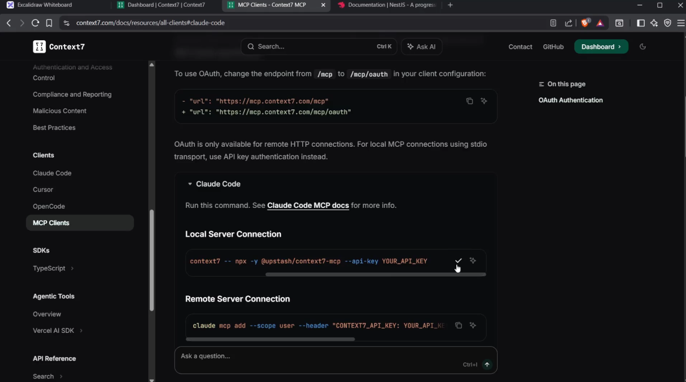

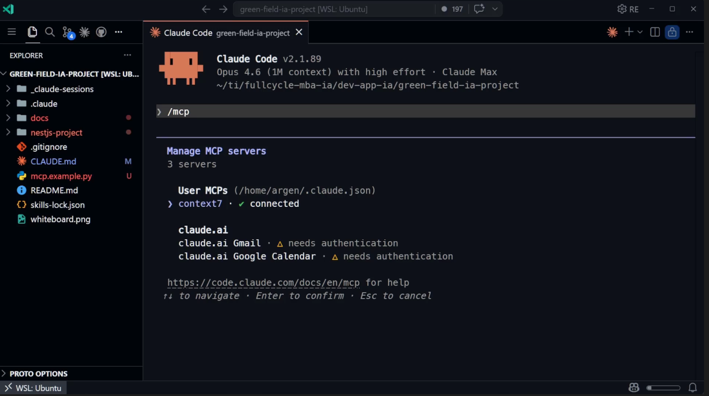

## Configurando MCP do PostgreeSQL
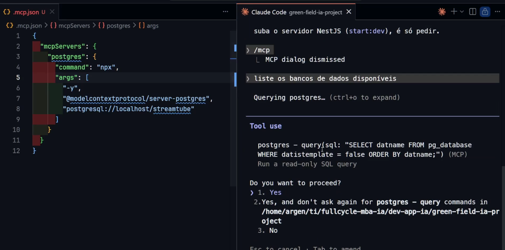

